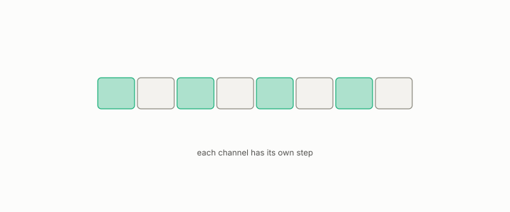

# per-channel quantizer

**id.** per-channel-quantizer
**kind.** instrument

## definition

A quantizer that chooses a scale per coordinate. Chapter 11.

**Example.** With per-coordinate steps of 0.5 and 0.1, the vector (1.3, 0.27) is stored as (1.5, 0.3).

## equation

none

## conditions

- A quantizer that chooses a step per coordinate. The squared error of a vector is at most the sum of the squared half steps, and a finer step on one coordinate lowers that coordinate's bound alone, which is the allocation water-filling makes by sensitivity.
- At four bits the per-channel uniform quantizer held the perplexity at 14.91 against 12.24 uncompressed, where the direction-only quantizer at the same bits did not.

Conditions are curated in `entries.toml` rather than read from a record.

## ledger

none

## first stated

Chapter 11 section 11.2 of *Data Mining as Observation*, with the per-channel rows of the quantizer table in `turboquant-pro/docs/KV_KEYS_FINDING.md:1-49`.

## measurements

| Where the book states it | Numbers, as the book's sources table records them | Source |
|---|---|---|
| chapter 11 section 11.2 | fp16 12.24, values-only 13.12, PolarQuant K4 10643 and 0.095, per-channel uniform K4 14.91 and 0.062, per-channel NUQ K3 15.77 and 0.148, 2.4x and 670x, pre-rotary near 22000, 2 key heads serve 12 query heads | [`turboquant-pro/docs/KV_KEYS_FINDING.md:1-49`](https://github.com/ahb-sjsu/turboquant-pro/blob/856c4cb/docs/KV_KEYS_FINDING.md#L1-L49) |

## failures and corrections

none

## invariance envelope

none declared

## machine checked

[`lean/DataMiningAsObservation/Quantization.lean`](https://github.com/ahb-sjsu/observation-data-mining/blob/c149a10/lean/DataMiningAsObservation/Quantization.lean), theorems `error_le_half_step`, `quantize_level`, `half_step_bound`, `sq_error_le`, `finer_step`, at observation-data-mining c149a10; what the check covers is stated in the book's [appendix C](https://github.com/ahb-sjsu/observation-data-mining/blob/c149a10/chapters/machine_checked.md).

## used in

*Data Mining as Observation* chapters 0, 3, 4, 11.

## related

quantization, direction-only-quantizer, water-filling, kv-cache

## see also

Book equations stated beside the entry's terms, not defining it: 11.1, 0.13.

Ledger rows that cite the entry's records without naming it: NEG-2.

Sources-table rows that share a record with the entry without naming it: chapter 1 section 1.4, chapter 2 section 2.5, chapter 3 section 3.2, chapter 8 section 8.2, chapter 11 section 11.1.

## status

Generated 2026-09-09 by `encyclopedia/generate.py`; book at observation-data-mining c149a10; the commit of every record is listed in the encyclopedia's provenance.
