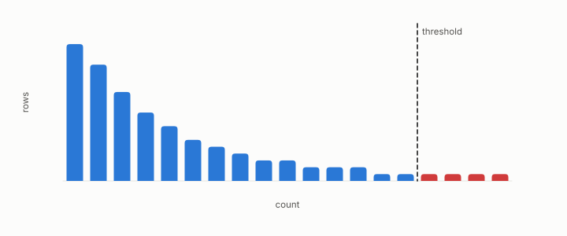

# percentile

**id.** percentile
**kind.** concept

## definition

The value below which a given fraction of the rows fall. The fraction at or below a value is nondecreasing in the value. Chapter 11 section 11.3.

**Example.** Among 100 sorted ratios, the 97.5th over the 2.5th percentile is the rank certificate's percentile setting.

## equation

Book equation 11.2.

    \begin{gathered} r=\frac{d_{\mathrm{compressed}}}{d_{\mathrm{exact}}},\qquad \kappa_{\text{strict}}=\frac{\max r}{\min r},\qquad \tau\ \ge\ 1-2\hat\mu(\kappa_{\text{strict}}),\qquad \rho_S\ \ge\ 1-3\hat\mu(\kappa_{\text{strict}}), \\ \kappa_{97.5/2.5}=\frac{q_{97.5}(r)}{q_{2.5}(r)}\ \text{ gives the same two expressions as estimates, not floors.} \end{gathered}

## conditions

- The value below which a given fraction of the rows fall. The fraction at or below a value is nonnegative, at most one, nondecreasing in the value, one at or above the largest row and zero below the smallest, and an upper percentile over a lower one is at least one.
- The rank certificate's percentile setting reads the 97.5 over 2.5 percentile ratio as a robust estimate where the strict setting reads the max over min, and the anti-hub gate reads the fifth percentile of recall.

Conditions are curated in `entries.toml` rather than read from a record.

## ledger

none

## first stated

Chapter 11 section 11.3 of *Data Mining as Observation*, with the percentile setting of the rank certificate in `turboquant-pro/turboquant_pro`.

## measurements

| Where the book states it | Numbers, as the book's sources table records them | Source |
|---|---|---|
| chapter 11 section 11.6 | anti-hub recall, p05, hub-rank correlation, hub-set overlap, the build gate | [`turboquant-pro/docs/HUBNESS_PRIMER.md:86-131`](https://github.com/ahb-sjsu/turboquant-pro/blob/856c4cb/docs/HUBNESS_PRIMER.md#L86-L131) |

## failures and corrections

none

## invariance envelope

none declared

## machine checked

[`lean/DataMiningAsObservation/Percentile.lean`](https://github.com/ahb-sjsu/observation-data-mining/blob/95af30c/lean/DataMiningAsObservation/Percentile.lean), theorems `cdf_nonneg`, `cdf_le_one`, `cdf_mono`, `cdf_of_all`, `cdf_of_none`, `ratio_ge_one`, at observation-data-mining 95af30c; what the check covers is stated in the book's [appendix C](https://github.com/ahb-sjsu/observation-data-mining/blob/95af30c/chapters/machine_checked.md).

## used in

*Data Mining as Observation* chapters 3, 10, 11.

## related

rank-certificate, anti-hub-recall, skewness, threshold, robin-hood-index

## see also

Book equations stated beside the entry's terms, not defining it: 0.35, 10.3.

Ledger rows that cite the entry's records without naming it: NEG-14.

Sources-table rows that share a record with the entry without naming it: chapter 10 section 10.2, chapter 10 section 10.3, chapter 11 section 11.2.

## status

Generated 2026-09-08 by `encyclopedia/generate.py`; book at observation-data-mining 95af30c; the commit of every record is listed in the encyclopedia's provenance.
