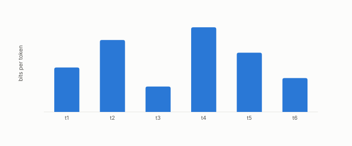

# perplexity

**id.** perplexity
**kind.** concept

## definition

Two to the power of the average number of bits a language model needs per token of a test text. Lower is better. Equation 0.22.

**Example.** An average of 3.585 bits per token gives perplexity 2 to the 3.585, which is 12.

## equation

Book equation 0.22.

    \mathrm{PPL}=2^{H},\qquad H=-\frac1T\sum_{t=1}^{T}\log_2 p\big(w_t\mid w_{<t}\big).

Book equation 11.1.

    \cos\big(k,\hat k\big)=0.995\qquad\text{while}\qquad \mathrm{PPL}:\ 12.24\ \to\ 10643.

## conditions

- Two to the power of the average number of bits a language model needs per token of a test text. It is at least one, equals the vocabulary size for a model that spreads its mass evenly, and is monotone in the bits.
- The attention-key finding raised it from 12.24 to 10643 at cosine 0.995, a rise of more than nine bits per token, and the recalibration that improved the reconstruction worsened it, the two standing negatives that keep reconstruction error off the list of acceptance metrics.

Conditions are curated in `entries.toml` rather than read from a record.

## ledger

none

## first stated

Chapter 0 section 0.11 of *Data Mining as Observation*, with the program's case in `turboquant-pro/docs/KV_KEYS_FINDING.md:1-49`.

## measurements

| Where the book states it | Numbers, as the book's sources table records them | Source |
|---|---|---|
| chapter 1 section 1.4 | cosine 0.995 and perplexity of order ten thousand, the recalibration negative | [`geometric-observation/chapters/ch02_failure_of_observer_free_measurement.md:40-60`](https://github.com/ahb-sjsu/geometric-observation/blob/fc6b378/chapters/ch02_failure_of_observer_free_measurement.md#L40-L60); [`geometric-observation/chapters/ch16_honest_negatives.md`](https://github.com/ahb-sjsu/geometric-observation/blob/fc6b378/chapters/ch16_honest_negatives.md) NEG-2 and NEG-4; [`turboquant-pro/docs/KV_KEYS_FINDING.md:1-49`](https://github.com/ahb-sjsu/turboquant-pro/blob/856c4cb/docs/KV_KEYS_FINDING.md#L1-L49) |
| chapter 8 section 8.2 | cosine 0.995, perplexity near 1e4 | [`turboquant-pro/docs/KV_KEYS_FINDING.md:1-49`](https://github.com/ahb-sjsu/turboquant-pro/blob/856c4cb/docs/KV_KEYS_FINDING.md#L1-L49); [`geometric-observation/chapters/ch16_honest_negatives.md`](https://github.com/ahb-sjsu/geometric-observation/blob/fc6b378/chapters/ch16_honest_negatives.md) NEG-2 |

## failures and corrections

none

## invariance envelope

none declared

## machine checked

[`lean/DataMiningAsObservation/Perplexity.lean`](https://github.com/ahb-sjsu/observation-data-mining/blob/6aebdf3/lean/DataMiningAsObservation/Perplexity.lean), theorems `bits_nonneg`, `one_le_perplexity`, `perplexity_uniform`, `perplexity_mono`, `bits_of_finding`, at observation-data-mining 6aebdf3; what the check covers is stated in the book's [appendix C](https://github.com/ahb-sjsu/observation-data-mining/blob/6aebdf3/chapters/machine_checked.md).

## used in

*Data Mining as Observation* chapters 0, 1, 8, 11.

## related

kl-divergence, flip, identity-reader, read-distortion

## see also

Ledger rows that cite the entry's records without naming it: NEG-2, NEG-4.

Sources-table rows that share a record with the entry without naming it: chapter 2 section 2.5, chapter 3 section 3.2, chapter 11 section 11.1, chapter 11 section 11.2.

## status

Generated 2026-09-09 by `encyclopedia/generate.py`; book at observation-data-mining 6aebdf3; the commit of every record is listed in the encyclopedia's provenance.
