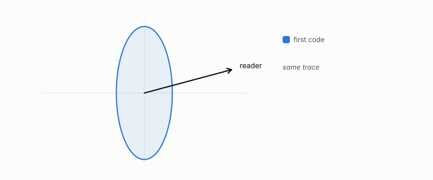

# planted

**id.** planted
**kind.** instrument

## definition

Of a case, built so that the answer is known before the instrument reads it, such as an affine consumer whose read operator is its weight vector's outer product. Chapter 6 section 6.2.

**Example.** An affine consumer with weight vector (3, 4) has read operator proportional to the matrix with rows (9, 12) and (12, 16), which the probe must recover.

## equation

none

## conditions

- Of a case, built so that the answer is known before the instrument reads it. An affine consumer has a known read operator, the outer product of its weight vector, so a probe that recovers it has been tested against a truth.
- The planted probe recovered the read subspace at overlap 0.936 against chance 0.059, twelve of twelve, and the real model then missed its bar at 0.567 against 0.60, which is the order the book keeps.

Conditions are curated in `entries.toml` rather than read from a record.

## ledger

none

## first stated

Chapter 6 section 6.2 of *Data Mining as Observation*, with the planted probe in `geometric-observation/claims/LEDGER.md` row GO-1.

## measurements

| Where the book states it | Numbers, as the book's sources table records them | Source |
|---|---|---|
| chapter 6 section 6.2 | planted probe, overlap 0.936 vs 0.059, twelve of twelve, reconstruction 0.40, five of five | [`geometric-observation/claims/LEDGER.md`](https://github.com/ahb-sjsu/geometric-observation/blob/fc6b378/claims/LEDGER.md) row GO-1 |

## failures and corrections

none

## invariance envelope

none declared

## machine checked

[`lean/DataMiningAsObservation/ReadOperator.lean`](https://github.com/ahb-sjsu/observation-data-mining/blob/f3914f0/lean/DataMiningAsObservation/ReadOperator.lean), theorems `rank_one_reads_one_direction`, `readOp_mulVec`, `quad_readOp`, `quad_readOp_nonneg`, `readOp_mulVec_eq_zero_iff`, `readOp_diag`, `readOp_offdiag`, `readOp_symm`, `readOp_neg`, `affine_const_along_nuisance`, `readOp_affine`, `readOp_sqLength_basis`, at observation-data-mining f3914f0; what the check covers is stated in the book's [appendix C](https://github.com/ahb-sjsu/observation-data-mining/blob/f3914f0/chapters/machine_checked.md).

[`lean/DataMiningAsObservation/ProbeCliff.lean`](https://github.com/ahb-sjsu/observation-data-mining/blob/f3914f0/lean/DataMiningAsObservation/ProbeCliff.lean), theorems `centralDiff_affine`, `centralDiff_basis`, `exists_blind_direction`, `indistinguishable`, `budget_cliff`, at observation-data-mining f3914f0; what the check covers is stated in the book's [appendix C](https://github.com/ahb-sjsu/observation-data-mining/blob/f3914f0/chapters/machine_checked.md).

## used in

*Data Mining as Observation* chapters 3, 6, 8, 11.

## related

blind-probe, read-operator, control, budget-cliff, identifiability

## see also

Book equations stated beside the entry's terms, not defining it: 0.9, 6.1, 11.4.

Ledger rows that cite the entry's records without naming it: GO-1, NEG-12.

Sources-table rows that share a record with the entry without naming it: chapter 11 section 11.7.

## status

Generated 2026-09-10 by `encyclopedia/generate.py`; book at observation-data-mining f3914f0; the commit of every record is listed in the encyclopedia's provenance.
