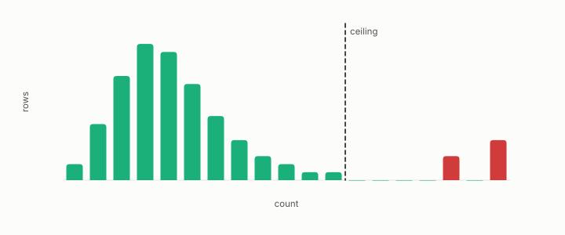

# Poisson ceiling

**id.** poisson-ceiling
**kind.** instrument

## definition

The largest neighbour count that at least one point in a dataset would reach by chance under a Poisson null, above which a count is evidence of a hub. Equation 0.17.

**Example.** With 1000 queries at k equal to 10 over 1000 rows, each row expects 10 retrievals, and a count above about 20 is beyond chance.

## equation

Book equation 0.17.

    \Pr[X\ge c]=1-\sum_{i<c}e^{-\mu}\frac{\mu^{i}}{i!},\qquad c^{\star}=\max\{c:\ n\Pr[X\ge c]\ge 1\},\qquad \mu=\frac{n_q\,k}{n}.

## conditions

- Under the null that the slots are handed out at random, a row's count is Poisson with mean the slots per row, and the ceiling is the largest count at least one row would reach by chance. A count above it is evidence of a hub, and a count below it is not evidence of anything.
- The ceiling depends on the query set, through the mean and through the rows the queries reach, so it is recomputed when the queries change, and the program's first hubness numbers moved by a factor of several when query coupling was removed.

Conditions are curated in `entries.toml` rather than read from a record.

## ledger

none

## first stated

openvector-bench, `openvector-bench/openvector_bench/hubness.py:41-100`, and chapter 0 section 0.8 and chapter 3 section 3.5 of *Data Mining as Observation*.

## measurements

| Where the book states it | Numbers, as the book's sources table records them | Source |
|---|---|---|
| chapter 3 section 3.5 | Poisson null, hub excess, budget parameter | `openvector-bench/openvector_bench/hubness.py:41-100` |

## failures and corrections

none

## invariance envelope

none declared

## machine checked

[`lean/DataMiningAsObservation/PoissonCeiling.lean`](https://github.com/ahb-sjsu/observation-data-mining/blob/95af30c/lean/DataMiningAsObservation/PoissonCeiling.lean), theorems `mass_nonneg`, `tail_antitone`, `tail_zero`, `tail_le_one`, `expectedAtLeast_antitone`, `example_mean`, at observation-data-mining 95af30c; what the check covers is stated in the book's [appendix C](https://github.com/ahb-sjsu/observation-data-mining/blob/95af30c/chapters/machine_checked.md).

## used in

*Data Mining as Observation* chapters 0, 3.

## related

hubness, anti-hub, harness, min-over-strata

## see also

Book equations stated beside the entry's terms, not defining it: 10.3.

Ledger rows that cite the entry's records without naming it: NEG-11.

Sources-table rows that share a record with the entry without naming it: chapter 3 section 3.5, chapter 8 section 8.1, chapter 10 section 10.2, chapter 10 section 10.3, chapter 11 section 11.6.

## status

Generated 2026-09-08 by `encyclopedia/generate.py`; book at observation-data-mining 95af30c; the commit of every record is listed in the encyclopedia's provenance.
