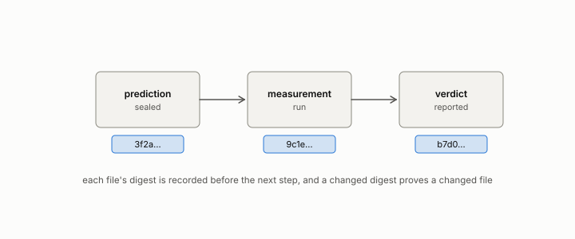

# posited versus measured

**id.** posited-versus-measured
**kind.** concept

## definition

The division of every claim in a report into those asserted by design and those backed by an artifact. Chapter 14.

**Example.** The four geometric volumes are posited; the twelve-domain flip is measured.

## equation

none

## conditions

- Every claim in a report is either posited, asserted by design with no artifact behind it, or measured, backed by a committed artifact the reader can open. The division is stated at the top of the report and not inferred from the prose.
- A posited claim carries no ledger class above exploratory, and it stays there until a sealed measurement moves it. The ledger rule that says so is the one machine-checked in the book.
- Four volumes of the program are posited in their entirety and say so on their first page. Their claims are cited only as proposals.

Conditions are curated in `entries.toml` rather than read from a record.

## ledger

none

## first stated

The epistemic banners of the four posited volumes, `geometric-ai/README.md`, `geometric-cognition/README.md`, `geometric-reasoning/README.md`, `geometric-education/README.md`, and chapter 14 section 14.8 of *Data Mining as Observation*.

## measurements

| Where the book states it | Numbers, as the book's sources table records them | Source |
|---|---|---|
| chapter 14 section 14.8 | registry rules, V4 proved in Lean and verified 2026-08-17 at commit ea7ee82, D4 posited with the drift list, reliability weight as one formula one source, 8 of 9 | [`erisml-lib/docs/CONCEPT_REGISTRY.md:1-160`](https://github.com/ahb-sjsu/erisml-lib/blob/c368921/docs/CONCEPT_REGISTRY.md#L1-L160) |
| chapter 14 section 14.8 | the four posited volumes | `geometric-ai/README.md`; `geometric-cognition/README.md`; `geometric-reasoning/README.md`; `geometric-education/README.md` epistemic banners |

## failures and corrections

none

## machine checked

[`lean/DataMiningAsObservation/Ledger.lean`](https://github.com/ahb-sjsu/observation-data-mining/blob/95af30c/lean/DataMiningAsObservation/Ledger.lean), theorems `step_none`, `step_miss_le`, `step_pass_ge`, `step_miss_refuted`, `exploratory_stays`, at observation-data-mining 95af30c; what the check covers is stated in the book's [appendix C](https://github.com/ahb-sjsu/observation-data-mining/blob/95af30c/chapters/machine_checked.md).

## used in

*Data Mining as Observation* chapters 14.

## related

ledger-class, preregistration, sealed, reliability-weight

## see also

Book equations stated beside the entry's terms, not defining it: 1.1.

Ledger rows that cite the entry's records without naming it: OT-11, NEG-15 (Bell boundary).

## status

Generated 2026-09-07 by `encyclopedia/generate.py`; book at observation-data-mining 95af30c; the commit of every record is listed in the encyclopedia's provenance.
