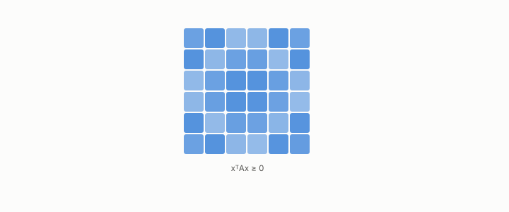

# positive semidefinite

**id.** positive-semidefinite
**kind.** concept

## definition

Of a symmetric matrix, having every quadratic form nonnegative, as the read operator and the covariance are. Chapter 0 section 0.3.

**Example.** The matrix with rows (1, 2) and (2, 4) is positive semidefinite, and the one with rows (1, 3) and (3, 1) is not, since (1, −1) gives −4.

## equation

Book equation 0.9.

    P_C=\mathbb E\!\left[g\,g^{\top}\right],\qquad g=\nabla C(x).

Book equation 0.11.

    P_C(x)=J(x)^{\top}G\big(C(x)\big)\,J(x),\qquad J(x)=\frac{\partial C}{\partial x}(x),\qquad \bar P_{C,\mu}=\mathbb E_{\mu}\!\left[P_C(x)\right].

## conditions

- Of a symmetric matrix, having every quadratic form nonnegative. A sum of such matrices is one, a nonnegative multiple is one, an outer product of a vector with itself is one, the read operator is one whenever the weights are nonnegative, and the diagonal entries are nonnegative.
- The local metric on a consumer's output is positive semidefinite and exists only where the output metric has a local quadratic representation, and every eigenvalue of a positive semidefinite matrix is nonnegative.

Conditions are curated in `entries.toml` rather than read from a record.

## ledger

none

## first stated

Chapter 0 section 0.3 and section 0.5 of *Data Mining as Observation*.

## measurements

none

## failures and corrections

none

## machine checked

[`lean/DataMiningAsObservation/PositiveSemidefinite.lean`](https://github.com/ahb-sjsu/observation-data-mining/blob/95af30c/lean/DataMiningAsObservation/PositiveSemidefinite.lean), theorems `psd_add`, `psd_smul`, `psd_outer`, `psd_readOp`, `psd_diag_nonneg`, at observation-data-mining 95af30c; what the check covers is stated in the book's [appendix C](https://github.com/ahb-sjsu/observation-data-mining/blob/95af30c/chapters/machine_checked.md).

## used in

*Data Mining as Observation* chapters 0, 2.

## related

read-operator, covariance-matrix, outer-product, eigenvalue-eigenvector, metric

## see also

Book equations stated beside the entry's terms, not defining it: 0.3.

Ledger rows that cite the entry's records without naming it: OT-7.

Sources-table rows that share a record with the entry without naming it: chapter 2 section 2.2.

## status

Generated 2026-09-07 by `encyclopedia/generate.py`; book at observation-data-mining 95af30c; the commit of every record is listed in the encyclopedia's provenance.
