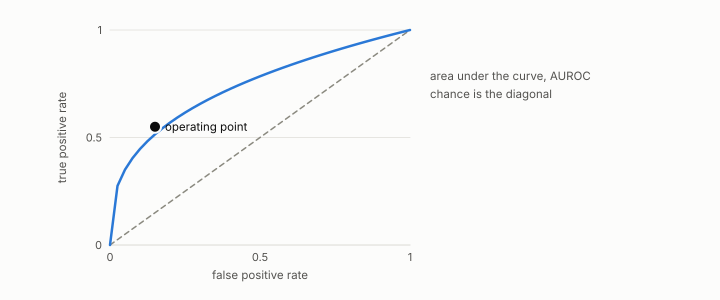

# precision, recall

**id.** precision-recall
**kind.** concept

## definition

The fraction of predicted positives that are truly positive, and the fraction of true positives that were predicted. Equation 0.28.

**Example.** Ten rows called positive, six of them correct, out of eight true positives, is precision 0.6 and recall 0.75.

## equation

Book equation 0.28.

    P=\frac{TP}{TP+FP},\qquad R=\frac{TP}{TP+FN},\qquad F_1=\frac{2PR}{P+R}.

## conditions

- The fraction of predicted positives that are truly positive, and the fraction of true positives that were predicted, both in the unit interval. F1 is their harmonic mean, between the smaller of the two and their arithmetic mean, equal to both when they agree, and zero when either is zero.
- In counts F1 is twice the true positives over twice the true positives plus the false positives and false negatives, the form the Youden ceiling bounds.

Conditions are curated in `entries.toml` rather than read from a record.

## ledger

none

## first stated

Chapter 0 section 0.14 of *Data Mining as Observation*, with the program's precision targets in `gtc-prototype/docs/SPECTRUM_FINDINGS.md:84-88`.

## measurements

| Where the book states it | Numbers, as the book's sources table records them | Source |
|---|---|---|
| chapter 14 section 14.7 | 51 percent moderated at 80 and 95 percent precision on the balanced set | [`gtc-prototype/docs/SPECTRUM_FINDINGS.md:84-88`](https://github.com/ahb-sjsu/gtc-prototype/blob/328741f/docs/SPECTRUM_FINDINGS.md#L84-L88) |

## failures and corrections

none

## machine checked

[`lean/DataMiningAsObservation/PrecisionRecall.lean`](https://github.com/ahb-sjsu/observation-data-mining/blob/95af30c/lean/DataMiningAsObservation/PrecisionRecall.lean), theorems `precision_mem_unit`, `recall_mem_unit`, `f1_le_mean`, `min_le_f1`, `f1_self`, `f1_zero`, `f1_counts`, at observation-data-mining 95af30c; what the check covers is stated in the book's [appendix C](https://github.com/ahb-sjsu/observation-data-mining/blob/95af30c/chapters/machine_checked.md).

## used in

*Data Mining as Observation* chapters 0, 1, 4, 6, 8, 9, 10, 11, 12, 14.

## related

f1, threshold, recall-at-k, youden-f1-bound

## see also

Book equations stated beside the entry's terms, not defining it: 6.2.

## status

Generated 2026-09-07 by `encyclopedia/generate.py`; book at observation-data-mining 95af30c; the commit of every record is listed in the encyclopedia's provenance.
