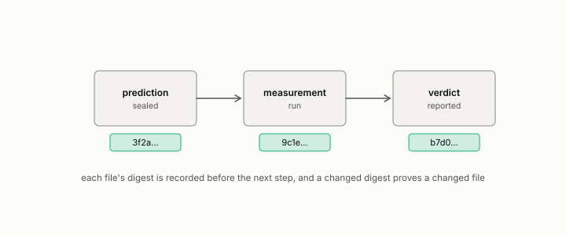

# preregistration

**id.** preregistration
**kind.** instrument

## definition

Committing the hypothesis, the bar, and the analysis before the measurement is run, so that the record shows what was predicted. Chapter 8.

**Example.** The prediction, the bar, the null, and the seeds were committed before the run, and the commit hash is in the report.

## equation

none

## conditions

- A preregistration commits the hypothesis, the bar, the analysis, and the missing-data rule before the measurement is run, so that the record shows what was predicted rather than what was found.
- Its bar must be anti-vacuous. A pass that any instrument would have produced, a threshold met by every reading, proves nothing, and the program's own first PF5 pass is the case.
- Multiple looks at the data need a corrected threshold, and a preregistration that names one look needs none.

Conditions are curated in `entries.toml` rather than read from a record.

## ledger

none

## first stated

Chapter 8 section 8.8 of *Data Mining as Observation*, with the program's template `observation-theory-campaigns/experiments/PREREG-TEMPLATE.md:1-71` and Volume 14's protocol `geometric-observation/PROTOCOL.md:58-75`.

## measurements

| Where the book states it | Numbers, as the book's sources table records them | Source |
|---|---|---|
| chapter 2 section 2.3 | the missing-data rule as a required preregistration field | [`observation-theory-campaigns/experiments/PREREG-TEMPLATE.md:47-52`](https://github.com/ahb-sjsu/observation-theory-campaigns/blob/80d1414/experiments/PREREG-TEMPLATE.md#L47-L52) |
| chapter 7 section 7.6 | the preregistration fields | instructor working documents, not public [@bond2026course], `ECE_514-01_FA26_session-outlines.md:157-176`; chapter 8 section 8.8 of this book |

## failures and corrections

- [`observation-theory-campaigns/ERRATA.md:90-110`](https://github.com/ahb-sjsu/observation-theory-campaigns/blob/80d1414/ERRATA.md#L90-L110) at 80d1414. E3. Two wrong bar values in the campaign notes **Found** 2026-08-07, same pass. Not a published error. `experiments/CAMPAIGN.md` twice described the PF4-006 entry-point and timestep clause as having a bar of 1e-10. The sealed declaration and the committed record both set that bar at 1e-8. The 1e-10 figure is the separate translation-covariance bar. The narrative was wrong and the verdict was not, since the clause failed at 1.3e-2 against either number. The same document described PREREG-PF4-009 as passing all six bars. The sealed document groups its requirements into six bars and the governed runner reports eight items, and the mapping between them was never declared. Both statements are now made explicitly. Corrected in place, since these are working notes rather than sealed documents or published records. ---

## invariance envelope

none declared

## machine checked

[`lean/DataMiningAsObservation/Bonferroni.lean`](https://github.com/ahb-sjsu/observation-data-mining/blob/95af30c/lean/DataMiningAsObservation/Bonferroni.lean), theorems `family_error_le`, `bonferroni`, `one_look`, at observation-data-mining 95af30c; what the check covers is stated in the book's [appendix C](https://github.com/ahb-sjsu/observation-data-mining/blob/95af30c/chapters/machine_checked.md).

## used in

*Data Mining as Observation* chapters 1, 2, 3, 4, 5, 6, 7, 8, 9, 10, 11, 12, 13, 14.

## related

sealed, ledger-class, harness, certificate

## see also

Book equations stated beside the entry's terms, not defining it: 8.3.

Ledger rows that cite the entry's records without naming it: OT-7, GO-2 (neg. half: not reconstruction).

Sources-table rows that share a record with the entry without naming it: chapter 1 section 1.1, chapter 1 section 1.3, chapter 1 section 1.6, chapter 1 section 1.7, chapter 2 section 2.3, chapter 5 section 5.3, chapter 8 section 8.3, chapter 8 section 8.8.

## status

Generated 2026-09-08 by `encyclopedia/generate.py`; book at observation-data-mining 95af30c; the commit of every record is listed in the encyclopedia's provenance.
