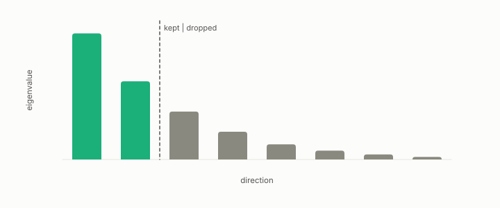

# principal component analysis

**id.** principal-component-analysis
**kind.** instrument

## definition

Projection of the centred data onto the eigenvectors of its covariance with the largest eigenvalues, the linear orthogonal projection of rank k that minimizes reconstruction error for the identity reader. Chapter 4.

**Example.** With eigenvalues 4, 3, 2, and 1, keeping the top two components drops an error of 3.

## equation

none

## conditions

- Projection of the centred data onto the eigenvectors of its covariance with the largest eigenvalues. Among linear orthogonal projections of rank k it minimizes the reconstruction error. In the eigenbasis the variance along a unit direction lies between the smallest and the largest eigenvalue, a basis direction attains its own eigenvalue, and the error of keeping k components is the sum of the dropped eigenvalues.
- It is the reduction that minimizes reconstruction error for the identity reader, which weighs all directions equally, which is to say for no particular reader at all. At matched reconstruction the consumer-aware code beat it in twelve of twelve domains, and truncation loses on compact sets.

Conditions are curated in `entries.toml` rather than read from a record.

## ledger

none

## first stated

Pearson, on lines and planes of closest fit, 1901, and Hotelling, 1933, as chapter 4 section 4.1 of *Data Mining as Observation* reads them, with the program's truncation record in `turboquant-pro/benchmarks/RESULTS_glove.md:1-40`.

## measurements

| Where the book states it | Numbers, as the book's sources table records them | Source |
|---|---|---|
| chapter 11 section 11.5 | 9.6x at recall 0.999 CI-gated on GloVe 1.18M; 32x at 0.9993 on private 199k LaBSE, ties OPQ, beats RaBitQ, 20x build; 27.7x and 114x reported; PCA truncation loses on compact sets; 20x at 199k and 4x at 1M over OPQ; RaBitQ builds in under a second | [`turboquant-pro/CLAIMS.md:28-49`](https://github.com/ahb-sjsu/turboquant-pro/blob/856c4cb/CLAIMS.md#L28-L49) |

## failures and corrections

none

## invariance envelope

none declared

## machine checked

[`lean/DataMiningAsObservation/PCA.lean`](https://github.com/ahb-sjsu/observation-data-mining/blob/f3914f0/lean/DataMiningAsObservation/PCA.lean), theorems `varAlong_basis`, `varAlong_le`, `varAlong_ge`, `dropped_eq`, `dropped_nonneg`, at observation-data-mining f3914f0; what the check covers is stated in the book's [appendix C](https://github.com/ahb-sjsu/observation-data-mining/blob/f3914f0/chapters/machine_checked.md).

## used in

*Data Mining as Observation* primer L, chapters 0, 1, 4, 6, 12.

## related

covariance-matrix, explained-variance, effective-rank, projection, identity-reader, flip-the

## see also

Book equations stated beside the entry's terms, not defining it: 0.5, 0.7, 4.2.

Ledger rows that cite the entry's records without naming it: GO-1, GO-6.

Sources-table rows that share a record with the entry without naming it: chapter 4 section 4.2, chapter 4 section 4.5.

## status

Generated 2026-09-10 by `encyclopedia/generate.py`; book at observation-data-mining f3914f0; the commit of every record is listed in the encyclopedia's provenance.
