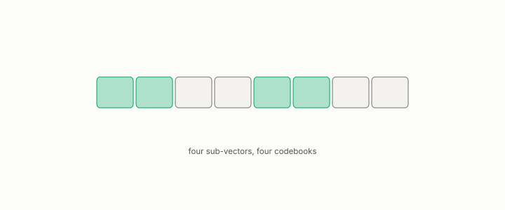

# product quantization

**id.** product-quantization
**kind.** instrument

## definition

Splitting a vector into pieces and quantizing each piece with its own codebook. Chapter 11.

**Example.** A 768-dimensional vector split into 8 pieces of 96, each coded with 256 centroids, costs 8 bytes.

## equation

none

## conditions

- Splitting a vector into pieces and quantizing each with its own codebook. The squared error of the whole is the sum of the pieces' errors, so the best code for the whole is the best code for each piece separately, and K entries per piece over M pieces address K to the M cells in M log₂ K bits.
- It is evaluated by recall at k per stratum and by the rank certificate, never by reconstruction error, and the anti-hub stratum is where it fails first.

Conditions are curated in `entries.toml` rather than read from a record.

## ledger

none

## first stated

Jégou, Douze, and Schmid, product quantization for nearest neighbor search, 2011, as chapter 11 section 11.3 of *Data Mining as Observation* presents it, with the program's comparisons in openvector-bench and turboquant-pro.

## measurements

none

## failures and corrections

none

## invariance envelope

none declared

## machine checked

[`lean/DataMiningAsObservation/ProductQuantization.lean`](https://github.com/ahb-sjsu/observation-data-mining/blob/f3914f0/lean/DataMiningAsObservation/ProductQuantization.lean), theorems `sq_error_add`, `inf_add`, `bits_of_codebooks`, `table_row`, at observation-data-mining f3914f0; what the check covers is stated in the book's [appendix C](https://github.com/ahb-sjsu/observation-data-mining/blob/f3914f0/chapters/machine_checked.md).

## used in

*Data Mining as Observation* chapters 0, 4, 8, 11, 13.

## related

recall-at-k, anti-hub, water-filling, rank-certificate

## see also

Book equations stated beside the entry's terms, not defining it: 11.3, 4.2.

Ledger rows that cite the entry's records without naming it: NEG-14.

Sources-table rows that share a record with the entry without naming it: chapter 10 section 10.4.

## status

Generated 2026-09-10 by `encyclopedia/generate.py`; book at observation-data-mining f3914f0; the commit of every record is listed in the encyclopedia's provenance.
