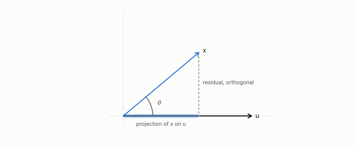

# projection

**id.** projection
**kind.** concept

## definition

The component of a vector along a unit direction. Equation 0.2.

**Example.** The projection of (3, 4) onto the unit direction (1, 0) is (3, 0), and the residual (0, 4) is orthogonal to it.

## equation

Book equation 0.2.

    \operatorname{proj}_u(x)=(u\cdot x)\,u,\qquad \|u\|=1.

## conditions

- The component of a vector along a unit direction, the direction scaled by their dot product. Projecting twice is projecting once, the remainder is orthogonal to the direction, the projection is no longer than the vector, and adding anything orthogonal to the direction leaves it unchanged.
- The last is the quotient a one-direction reader takes. Row normalization is the projection onto the read subspace of the geodesic-rank consumer, and the invariant-nuisance split of the ledger is the same statement for a general consumer.

Conditions are curated in `entries.toml` rather than read from a record.

## ledger

none

## first stated

Chapter 0 section 0.2 of *Data Mining as Observation*, with the program's angular projection in Volume 14 chapter 9, `geometric-observation/chapters/ch09_legibility.md:31-41`.

## measurements

none

## failures and corrections

none

## invariance envelope

none declared

## machine checked

[`lean/DataMiningAsObservation/Projection.lean`](https://github.com/ahb-sjsu/observation-data-mining/blob/f3914f0/lean/DataMiningAsObservation/Projection.lean), theorems `proj_proj`, `dot_sub_proj`, `proj_sq_le`, `proj_add_orth`, `proj_add`, at observation-data-mining f3914f0; what the check covers is stated in the book's [appendix C](https://github.com/ahb-sjsu/observation-data-mining/blob/f3914f0/chapters/machine_checked.md).

## used in

*Data Mining as Observation* primer L, chapters 0, 1, 3, 4, 6, 7, 9, 11.

## related

dot-product, read-subspace, quotient, nuisance

## see also

Book equations stated beside the entry's terms, not defining it: 0.12a, 0.12b.

Ledger rows that cite the entry's records without naming it: GO-1.

Sources-table rows that share a record with the entry without naming it: chapter 6 section 6.2, chapter 11 section 11.7.

## status

Generated 2026-09-09 by `encyclopedia/generate.py`; book at observation-data-mining f3914f0; the commit of every record is listed in the encyclopedia's provenance.
