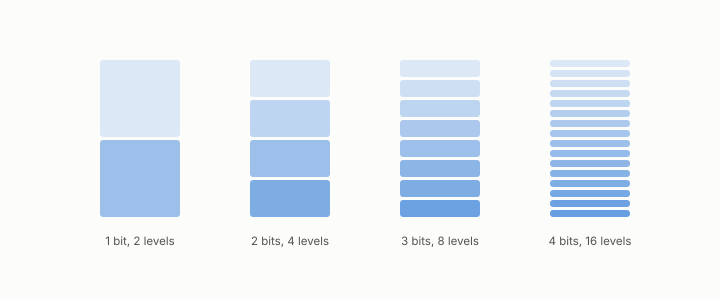

# quantization

**id.** quantization
**kind.** concept

## definition

Replacing each number with one of a small set of allowed values so that it can be stored in a few bits. Chapter 0 section 0.11.

## equation

Book equation 11.1.

    \cos\big(k,\hat k\big)=0.995\qquad\text{while}\qquad \mathrm{PPL}:\ 12.24\ \to\ 10643.

## conditions

- Replacing each number with one of a small set of allowed values so that it can be stored in a few bits. A uniform quantizer with a given step has error at most half the step and zero error on a level, and halving the step halves the bound.
- Those are the identity reader's bounds. What a quantizer does to a consumer is the flip's question, and the key quantizer table of chapter 11 is the case in which the smaller reconstruction error was the worse code.

Conditions are curated in `entries.toml` rather than read from a record.

## ledger

none

## first stated

Chapter 0 section 0.11 and chapter 11 section 11.2 of *Data Mining as Observation*, with the program's quantizer table in `turboquant-pro/docs/KV_KEYS_FINDING.md:1-49`.

## measurements

none

## failures and corrections

none

## machine checked

`lean/DataMiningAsObservation/Quantization.lean`, theorems `error_le_half_step`, `quantize_level`, `half_step_bound`, `sq_error_le`, `finer_step`, at observation-data-mining 08b4794.

## used in

*Data Mining as Observation* chapters 0, 2, 3, 4, 7, 8, 10, 11.

## related

bit, codebook, per-channel-quantizer, direction-only-quantizer, flip

## see also

Book equations stated beside the entry's terms, not defining it: 0.13.

Ledger rows that cite the entry's records without naming it: GO-2 (neg. half: not reconstruction), NEG-2.

Sources-table rows that share a record with the entry without naming it: chapter 1 section 1.4, chapter 2 section 2.5, chapter 3 section 3.2, chapter 8 section 8.2, chapter 8 section 8.9, chapter 11 section 11.1, chapter 11 section 11.2.

## status

Generated 2026-09-06 by `encyclopedia/generate.py`; book at observation-data-mining 08b4794; the commit of every record is listed in the encyclopedia's provenance.
