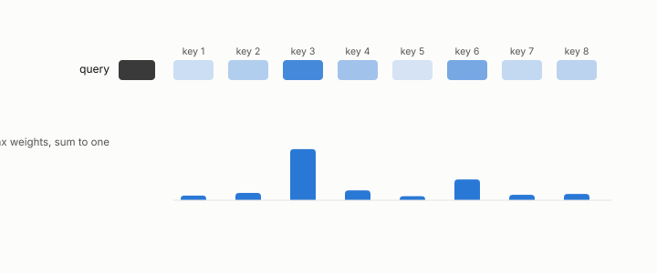

# query, key, value

**id.** query-key-value
**kind.** concept

## definition

The three vectors each token produces inside attention. The query is compared to earlier keys and the result weights the values. Chapter 0 section 0.11.

**Example.** A query scores each key, the scores become softmax weights, and the weights mix the values into one output.

## equation

Book equation 0.23.

    \operatorname{softmax}(z)_i=\frac{e^{z_i}}{\sum_j e^{z_j}},\qquad \text{output}=\sum_i\operatorname{softmax}\!\Big(\frac{q\cdot k_i}{\sqrt{d}}\Big)_{\!i}\,v_i.

Book equation 11.1.

    \cos\big(k,\hat k\big)=0.995\qquad\text{while}\qquad \mathrm{PPL}:\ 12.24\ \to\ 10643.

## conditions

- The three vectors each token produces inside attention. The query is compared to earlier keys and the result weights the values, so a head reads the keys only through their scores against the query and its output lies between the smallest and largest value.
- Keys are read along the query and values are averaged, so a compression that preserves query-key scores preserves every output, and one that preserves the keys' cosine need not.

Conditions are curated in `entries.toml` rather than read from a record.

## ledger

- *refutes or corrects.* NEG-2 `[refuted]`. Reconstruction cosine as a proxy for key quality. [`geometric-observation/claims/LEDGER.md:95`](https://github.com/ahb-sjsu/geometric-observation/blob/b2626a6/claims/LEDGER.md#L95).

## first stated

Chapter 0 section 0.11 of *Data Mining as Observation*, with the program's key-side measurements in `turboquant-pro/docs/KV_KEYS_FINDING.md:1-49`.

## measurements

| Where the book states it | Numbers, as the book's sources table records them | Source |
|---|---|---|
| chapter 11 section 11.1 | condition (A2), cosine satisfies it, post-rotary keys do not, the cone below cell size | [`turboquant-pro/docs/KV_KEYS_FINDING.md:61-86`](https://github.com/ahb-sjsu/turboquant-pro/blob/856c4cb/docs/KV_KEYS_FINDING.md#L61-L86); `the-angular-observer/README.md:26-31` |
| chapter 11 section 11.2 | fp16 12.24, values-only 13.12, PolarQuant K4 10643 and 0.095, per-channel uniform K4 14.91 and 0.062, per-channel NUQ K3 15.77 and 0.148, 2.4x and 670x, pre-rotary near 22000, 2 key heads serve 12 query heads | [`turboquant-pro/docs/KV_KEYS_FINDING.md:1-49`](https://github.com/ahb-sjsu/turboquant-pro/blob/856c4cb/docs/KV_KEYS_FINDING.md#L1-L49) |

## failures and corrections

- NEG-2, `[refuted]`. Reconstruction cosine as a proxy for key quality. [`geometric-observation/claims/LEDGER.md:95`](https://github.com/ahb-sjsu/geometric-observation/blob/b2626a6/claims/LEDGER.md#L95).

## invariance envelope

none declared

## machine checked

[`lean/DataMiningAsObservation/Attention.lean`](https://github.com/ahb-sjsu/observation-data-mining/blob/f3914f0/lean/DataMiningAsObservation/Attention.lean), theorems `output_le_max`, `min_le_output`, `output_congr`, `output_nuisance`, at observation-data-mining f3914f0; what the check covers is stated in the book's [appendix C](https://github.com/ahb-sjsu/observation-data-mining/blob/f3914f0/chapters/machine_checked.md).

## used in

*Data Mining as Observation* primers L and S, chapters 0, 1, 2, 3, 4, 5, 6, 7, 8, 9, 10, 11, 12, 13, 14.

## related

attention, head, kv-cache, softmax

## see also

Sources-table rows that share a record with the entry without naming it: chapter 1 section 1.4, chapter 2 section 2.5, chapter 3 section 3.2, chapter 8 section 8.2.

## status

Generated 2026-09-10 by `encyclopedia/generate.py`; book at observation-data-mining f3914f0; the commit of every record is listed in the encyclopedia's provenance.
