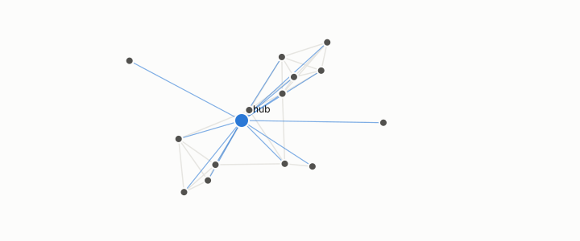

# query set

**id.** query-set
**kind.** concept

## definition

The rows a retrieval benchmark asks about. Hubness and the never-retrieved floor are properties of it. Chapter 3 section 3.5 and chapter 10 section 10.2.

**Example.** The 1000 queries of a benchmark decide which of the corpus's rows become hubs.

## equation

Book equation 10.3.

    N_k(x\mid Q)=\big|\{q\in Q:\ x\in\operatorname{top}_k(q)\}\big|,\qquad \text{anti-hub}:\ N_k(x)=0.

Book equation 10.4.

    \text{never retrieved}\ \ge\ 1-\frac{|Q|\,k}{n}\qquad\text{whenever}\quad |Q|\,k<n.

Book equation 0.17.

    \Pr[X\ge c]=1-\sum_{i<c}e^{-\mu}\frac{\mu^{i}}{i!},\qquad c^{\star}=\max\{c:\ n\Pr[X\ge c]\ge 1\},\qquad \mu=\frac{n_q\,k}{n}.

## conditions

- The rows a retrieval benchmark asks about. Two query sets that retrieve the same lists have the same hubs, no queries give no hubs, and the rows never retrieved number at least the row count less the queries times k, so hubness and the never-retrieved floor are properties of the query set.
- Queries drawn from the corpus inflated the first hub counts by a factor of several, and a generator matched on the query budget would be matched on an artifact.

Conditions are curated in `entries.toml` rather than read from a record.

## ledger

- *measures.* NEG-15 (Bell boundary) `[demonstrated]`. *Query-conditioned hubness supplies a mechanism for Bell-inequality violation without action at a distance.* Refuted as a mechanism; the settings-as-queries reframing survives only as vocabulary. [`geometric-observation/claims/LEDGER.md:93`](https://github.com/ahb-sjsu/geometric-observation/blob/ab4a0db/claims/LEDGER.md#L93).

## first stated

Chapter 3 section 3.5 and chapter 10 section 10.2 of *Data Mining as Observation*, with the query-coupling artifact in `openvector-bench/results/QUERY_COUPLING_ARTIFACT.md:1-20`.

## measurements

| Where the book states it | Numbers, as the book's sources table records them | Source |
|---|---|---|
| chapter 3 section 3.5 | query mass best single feature at every K for all four responses, seven features add at most 20 percent, threshold 1.25 on three of four, zero of four, 1000 real queries, 1024 dimensions | `openvector-bench/results/R13_STAGE0_RESULT.md:40-50`; `openvector-bench/results/R13_STAGE1_RESULT.md:1-40` |
| chapter 11 section 11.6 | query mass best single feature at every K for all four responses, seven features add at most 20 percent at 12 leaves, threshold 1.25 on three of four, zero of four, 1000 real queries, 1024 dimensions | `openvector-bench/results/R13_STAGE0_RESULT.md:40-50`; `openvector-bench/results/R13_STAGE1_RESULT.md:1-40` |

## failures and corrections

none

## invariance envelope

none declared

## machine checked

[`lean/DataMiningAsObservation/Hub.lean`](https://github.com/ahb-sjsu/observation-data-mining/blob/95af30c/lean/DataMiningAsObservation/Hub.lean), theorems `card_hubs_le`, `hubs_congr`, `hubs_anti`, `hubs_empty`, at observation-data-mining 95af30c; what the check covers is stated in the book's [appendix C](https://github.com/ahb-sjsu/observation-data-mining/blob/95af30c/chapters/machine_checked.md).

[`lean/DataMiningAsObservation/Hubness.lean`](https://github.com/ahb-sjsu/observation-data-mining/blob/95af30c/lean/DataMiningAsObservation/Hubness.lean), theorems `sum_count`, `sum_count_eq`, `count_congr`, `antiHub_iff`, at observation-data-mining 95af30c; what the check covers is stated in the book's [appendix C](https://github.com/ahb-sjsu/observation-data-mining/blob/95af30c/chapters/machine_checked.md).

## used in

*Data Mining as Observation* chapters 0, 1, 2, 3, 4, 8, 10, 11, 12, 13.

## related

hub, hubness, poisson-ceiling, recall-at-k, harness

## see also

Ledger rows that cite the entry's records without naming it: NEG-11.

Sources-table rows that share a record with the entry without naming it: chapter 3 section 3.5, chapter 8 section 8.1, chapter 10 section 10.2.

## status

Generated 2026-09-09 by `encyclopedia/generate.py`; book at observation-data-mining 95af30c; the commit of every record is listed in the encyclopedia's provenance.
