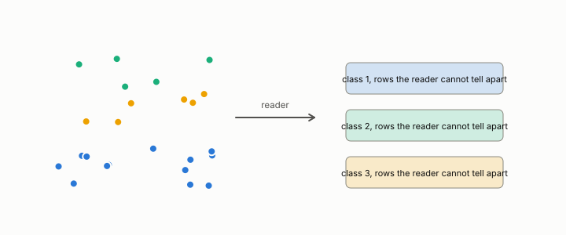

# quotient

**id.** quotient
**kind.** concept

## definition

The space of data with a set of transformations declared not to matter, so that two rows differing only by such a transformation are the same point. Every distance is a distance on some quotient. Equation 0.12.

**Example.** The cosine reader cannot tell (1, 1) from (2, 2), so the two are one row on its quotient.

**Known as, or related to prior art.** The information bottleneck's view of relevant information, what the consumer does not read may be discarded, stated for a fixed consumer without a variational objective.

## equation

Book equation 0.12a.

    x\sim_C x'\quad\Longleftrightarrow\quad d_G\big(C(x),C(x')\big)=0.

## conditions

- The equivalence x related to x' when their difference lies in the kernel of the read operator is exact for an affine consumer with a fixed output geometry.
- Three things are kept apart. Exact equivalence, that the consumer's outputs agree under its output metric. A local null direction, in the kernel of the operator at one row. A workload-common null direction, in the kernel of the workload average, unread at almost every row. For a nonlinear consumer the third does not deliver the first, and cosine similarity is the case, whose radial direction turns with the row.
- An invertible transform identifies no two rows and forms no quotient. It changes the geometry a reader sees. Discretization changes the quotient.

Conditions are curated in `entries.toml` rather than read from a record.

## ledger

- *refutes or corrects.* GO-5 `[refuted]`. An α=1 density/hubness quotient restores invariant fidelity in ≥1 non-spectral domain. [`geometric-observation/claims/LEDGER.md:67`](https://github.com/ahb-sjsu/geometric-observation/blob/b2626a6/claims/LEDGER.md#L67).
- *refutes or corrects.* NEG-6 `[refuted]`. Relative per-channel-demeaned error norm is the quotient-tangential quantity that controls softmax-KL. [`geometric-observation/claims/LEDGER.md:99`](https://github.com/ahb-sjsu/geometric-observation/blob/b2626a6/claims/LEDGER.md#L99).

## first stated

Volume 14, chapter 5, `geometric-observation/chapters/ch05_the_read_metric_and_the_quotient.md:78-90`, DOI 10.5281/zenodo.21776291, and chapter 3 section 3.1 of *Data Mining as Observation*, where every similarity measure induces a distance on some quotient.

## measurements

none

## failures and corrections

- GO-5, `[refuted]`. An α=1 density/hubness quotient restores invariant fidelity in ≥1 non-spectral domain. [`geometric-observation/claims/LEDGER.md:67`](https://github.com/ahb-sjsu/geometric-observation/blob/b2626a6/claims/LEDGER.md#L67).
- NEG-6, `[refuted]`. Relative per-channel-demeaned error norm is the quotient-tangential quantity that controls softmax-KL. [`geometric-observation/claims/LEDGER.md:99`](https://github.com/ahb-sjsu/geometric-observation/blob/b2626a6/claims/LEDGER.md#L99).

## invariance envelope

none declared

## machine checked

[`lean/DataMiningAsObservation/ReadOperator.lean`](https://github.com/ahb-sjsu/observation-data-mining/blob/f3914f0/lean/DataMiningAsObservation/ReadOperator.lean), theorems `rank_one_reads_one_direction`, `readOp_mulVec`, `quad_readOp`, `quad_readOp_nonneg`, `readOp_mulVec_eq_zero_iff`, `readOp_diag`, `readOp_offdiag`, `readOp_symm`, `readOp_neg`, `affine_const_along_nuisance`, `readOp_affine`, `readOp_sqLength_basis`, at observation-data-mining f3914f0; what the check covers is stated in the book's [appendix C](https://github.com/ahb-sjsu/observation-data-mining/blob/f3914f0/chapters/machine_checked.md).

## used in

*Data Mining as Observation* primers L and S, chapters 0, 1, 2, 3, 5, 6, 8, 9, 11, 12.

## related

read-operator, identity-reader, flip, hubness

## see also

Book equations stated beside the entry's terms, not defining it: 0.12b.

Ledger rows that cite the entry's records without naming it: GO-1.

Sources-table rows that share a record with the entry without naming it: chapter 2 section 2.2, chapter 3 section 3.6, chapter 6 section 6.2, chapter 11 section 11.7.

## status

Generated 2026-09-10 by `encyclopedia/generate.py`; book at observation-data-mining f3914f0; the commit of every record is listed in the encyclopedia's provenance.
