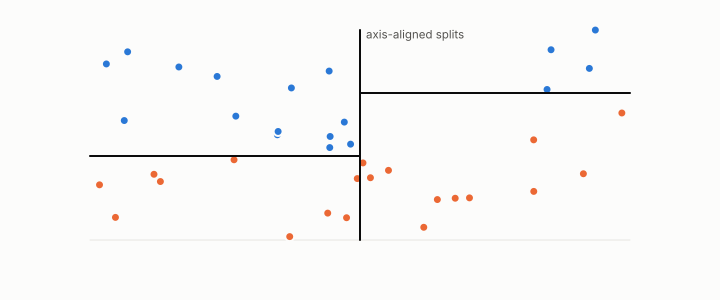

# random forest

**id.** random-forest
**kind.** instrument

## definition

An ensemble of decision trees, each fit on a bootstrap sample with a random subset of features at each split. Chapter 7.

**Example.** Five hundred trees, each on a bootstrap sample with 5 of 30 features tried per split, vote.

## equation

none

## conditions

- An ensemble of decision trees, each fit on a bootstrap sample with a random subset of features at each split, that averages or votes. The average lies between its members and its squared error is at most their mean squared error, and each tree is flat within a leaf so the forest's importances count splits.
- On the five-dataset benchmark the forest and the boosted trees win when the boundary needs many features and lose to a formula when it needs few.

Conditions are curated in `entries.toml` rather than read from a record.

## ledger

none

## first stated

Breiman, random forests, 2001, as chapter 7 section 7.1 of *Data Mining as Observation* reads it.

## measurements

| Where the book states it | Numbers, as the book's sources table records them | Source |
|---|---|---|
| chapter 7 section 7.1 | bagging variance, out-of-bag estimation, random forests, importances, AdaBoost | Hastie, Tibshirani, Friedman, ESL 2e chapters 15 and 10.1; TSK 2e 4.10 |

## failures and corrections

none

## invariance envelope

none declared

## machine checked

[`lean/DataMiningAsObservation/Ensemble.lean`](https://github.com/ahb-sjsu/observation-data-mining/blob/a0db6a8/lean/DataMiningAsObservation/Ensemble.lean), theorems `average_between`, `sq_average_le`, `average_const`, at observation-data-mining a0db6a8; what the check covers is stated in the book's [appendix C](https://github.com/ahb-sjsu/observation-data-mining/blob/a0db6a8/chapters/machine_checked.md).

[`lean/DataMiningAsObservation/DecisionTree.lean`](https://github.com/ahb-sjsu/observation-data-mining/blob/a0db6a8/lean/DataMiningAsObservation/DecisionTree.lean), theorems `stump_flat_left`, `stump_flat_right`, `split_reads_one_axis`, `gini_le_half`, `gini_eq_zero_iff`, at observation-data-mining a0db6a8; what the check covers is stated in the book's [appendix C](https://github.com/ahb-sjsu/observation-data-mining/blob/a0db6a8/chapters/machine_checked.md).

## used in

*Data Mining as Observation* chapters 6, 7.

## related

ensemble, decision-tree, bagging, importance, boosting

## see also

Book equations stated beside the entry's terms, not defining it: 6.1, 14.5.

Sources-table rows that share a record with the entry without naming it: chapter 6 section 6.3, chapter 7 section 7.3.

## status

Generated 2026-09-09 by `encyclopedia/generate.py`; book at observation-data-mining a0db6a8; the commit of every record is listed in the encyclopedia's provenance.
