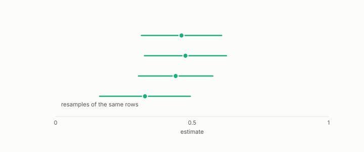

# rank certificate

**id.** rank-certificate
**kind.** instrument

## definition

A bound, computed from a compressed representation, that certifies which neighbour rankings the compression preserved for a consumer and which it did not. In its strict setting the floor is a guarantee, in its percentile setting an estimate. A vacuous result supplies no guarantee about the corpus, and falling back to exact reranking is the program's policy for it rather than a consequence. Chapter 11.

**Example.** A ratio spread kappa of 1.0148 with mu of 0.0664 certifies Kendall tau at least 0.8671 across 19900 pairs.

## equation

none

## conditions

- In the strict setting, the zeroth and hundredth percentiles of the distance ratio, the floor is a guarantee for the anchor sample, broken by a single collapsed pair.
- In the percentile setting the implementation computes the distortion on the retained central pairs and the concentration over all pairs, and the floor is a robust estimate, not a guarantee on either set.
- The floor is about the global ordering of the sampled pairwise distances. It does not directly certify a query's top-k recall, one query's neighbour order, or the trimmed tail.
- A floor on a sample of anchors is a statement about that sample. Carrying it to the corpus needs a sampling argument the certificate records the inputs for and does not supply.
- A vacuous certificate supplies no guarantee about the corpus. Reranking exactly is the policy the program adopts when the certificate is vacuous, and not something the certificate proves necessary.

Conditions are curated in `entries.toml` rather than read from a record.

## ledger

none

## first stated

The compression program's certificate specification, `turboquant-pro/docs/CERTIFICATE_SPEC.md`, DOI 10.5281/zenodo.20660087, and chapter 11 section 11.3 of *Data Mining as Observation*.

## measurements

none

## failures and corrections

- [`turboquant-pro/turboquant_pro/rank_certificate.py:25-36`](https://github.com/ahb-sjsu/turboquant-pro/blob/856c4cb/turboquant_pro/rank_certificate.py#L25-L36) at 856c4cb. * **Strict** (``lo=0, hi=100``): kappa is the true worst-case distortion (max/min per-pair ratio). The bound is then unconditional -- a genuine distribution-free floor over *all* pairs -- but a single collapsed or near-duplicate pair (ratio -> 0 or huge) sends kappa -> inf and makes the certificate vacuous, so it is brittle to data-artifact pairs. * **Robust** (the ``lo=2.5, hi=97.5`` default): kappa is the percentile-robust distortion, trimming the most-distorted ~5% of pairs. This is the sensible default and matches the source paper's torus protocol, but the resulting floor is **conditional**: it holds for the central 95% of pairs, *not* unconditionally over all of them. The trimmed tail can invert arbitrarily, so the reported floor is a robust estimate, not a hard worst-case guarantee. Use the strict regime when you need the unconditional bound.

## invariance envelope

none declared

## machine checked

[`lean/DataMiningAsObservation/RankCertificate.lean`](https://github.com/ahb-sjsu/observation-data-mining/blob/c149a10/lean/DataMiningAsObservation/RankCertificate.lean), theorems `nn_preserved`, `nn_preserved_of_kappa_one`, `kappa_ge_one`, at observation-data-mining c149a10; what the check covers is stated in the book's [appendix C](https://github.com/ahb-sjsu/observation-data-mining/blob/c149a10/chapters/machine_checked.md).

## used in

*Data Mining as Observation* chapters 11.

## related

certificate, vacuity-threshold, flip, hubness

## see also

Book equations stated beside the entry's terms, not defining it: 11.2, 11.3.

Ledger rows that cite the entry's records without naming it: GO-3.

Sources-table rows that share a record with the entry without naming it: chapter 4 section 4.5, chapter 8 section 8.9, chapter 9 section 9.3, chapter 11 section 11.2, chapter 11 section 11.3, chapter 11 section 11.5.

## status

Generated 2026-09-09 by `encyclopedia/generate.py`; book at observation-data-mining c149a10; the commit of every record is listed in the encyclopedia's provenance.
