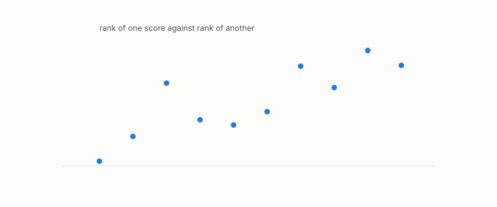

# rank-faithful

**id.** rank-faithful
**kind.** concept

## definition

Of a map, preserving the ordering of distances without any bound on the stretch. Chapter 0 section 0.10.

**Example.** A compression under which every one of the 19900 pair rankings is kept is rank-faithful.

## equation

Book equation 0.21.

    \frac1K\,d(x,y)\ \le\ d'\big(f(x),f(y)\big)\ \le\ K\,d(x,y)\qquad\text{for all }x,y.

## conditions

- A map is rank-faithful when it preserves the ordering of distances with no bound on the stretch. Every strictly increasing transform of the distance is rank-faithful, so a reader that ranks, the nearest-neighbour reader among them, returns the same answer under it.
- Rank-faithful and bi-Lipschitz are separate words. The square preserves every ordering and stretches large distances beyond any fixed factor, and the substrate table measures rank agreement, not stretch.

Conditions are curated in `entries.toml` rather than read from a record.

## ledger

none

## first stated

Volume 14, chapter 9, `geometric-observation/chapters/ch09_legibility.md:10-41`, DOI 10.5281/zenodo.21776291, and chapter 0 section 0.10 and chapter 3 section 3.3 of *Data Mining as Observation*.

## measurements

| Where the book states it | Numbers, as the book's sources table records them | Source |
|---|---|---|
| chapter 3 section 3.3 | row normalization is the projection onto the read subspace of the geodesic-rank consumer | [`geometric-observation/chapters/ch09_legibility.md:31-41`](https://github.com/ahb-sjsu/geometric-observation/blob/aec4c97/chapters/ch09_legibility.md#L31-L41); [`geometric-observation/chapters/ch03_historical_precursors.md:98-110`](https://github.com/ahb-sjsu/geometric-observation/blob/aec4c97/chapters/ch03_historical_precursors.md#L98-L110) |
| chapter 9 section 9.1 | the geodesic-rank reader discards the radius, row normalization is the angular projection | [`geometric-observation/chapters/ch09_legibility.md:10-41`](https://github.com/ahb-sjsu/geometric-observation/blob/aec4c97/chapters/ch09_legibility.md#L10-L41); `the-angular-observer/theorem.md:110-146` |

## failures and corrections

none

## invariance envelope

none declared

## machine checked

[`lean/DataMiningAsObservation/RankFaithful.lean`](https://github.com/ahb-sjsu/observation-data-mining/blob/95af30c/lean/DataMiningAsObservation/RankFaithful.lean), theorems `isRankFaithful_of_strictMono`, `closer_set_eq`, `nearest_eq`, `sq_rankFaithful_on_nonneg`, `sq_not_bi_lipschitz`, at observation-data-mining 95af30c; what the check covers is stated in the book's [appendix C](https://github.com/ahb-sjsu/observation-data-mining/blob/95af30c/chapters/machine_checked.md).

## used in

*Data Mining as Observation* chapters 0, 3.

## related

bi-lipschitz, rank-certificate, recognizer, quotient

## see also

Book equations stated beside the entry's terms, not defining it: 11.2.

Ledger rows that cite the entry's records without naming it: NEG-1.

Sources-table rows that share a record with the entry without naming it: chapter 3 section 3.2, chapter 3 section 3.3, chapter 9 section 9.2, chapter 11 section 11.1.

## status

Generated 2026-09-09 by `encyclopedia/generate.py`; book at observation-data-mining 95af30c; the commit of every record is listed in the encyclopedia's provenance.
