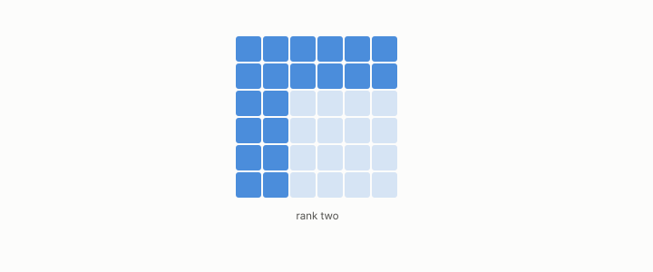

# rank

**id.** rank
**kind.** concept

## definition

The dimension of a matrix's column space, at most the number of rows and of columns. An outer product has rank at most one, and a product has rank at most either factor's. Chapter 0 section 0.2.

**Example.** The matrix with rows (1, 2) and (2, 4) has rank 1, and an outer product always does.

## equation

Book equation 0.7.

    r_{\mathrm{eff}}=\frac{\big(\sum_i\lambda_i\big)^{2}}{\sum_i\lambda_i^{2}}.

Book equation 2.1.

    P_{C_2\circ C_1}(x)=J_1(x)^{\top}\,P_{C_2}\big(C_1(x)\big)\,J_1(x),\qquad \operatorname{rank}P_{C_2\circ C_1}(x)\le\operatorname{rank}P_{C_2}\big(C_1(x)\big)\quad\text{at each row } x.

Book equation 6.1.

    s(x)=w\cdot x+b,\qquad P_C=\mathbb E\big[\sigma'(s)^{2}\big]\,w\,w^{\top},\qquad \operatorname{rank}P_C=1.

## conditions

- The dimension of a matrix's column space. It is at most the number of rows and of columns, an outer product has rank at most one, a product has rank at most the rank of either factor, and transposing does not change it.
- The read operator of a linear classifier has rank one, the composed read operator of a chain has rank at most either stage's, and the effective rank of a spectrum is the continuous version chapter 4 allocates bits by.

Conditions are curated in `entries.toml` rather than read from a record.

## ledger

- *measures.* OT-7 `[demonstrated]`. The damage form, trace pairing, rank, and loading covariance are GL(d)-invariant under `P' = A⁻ᵀPA⁻¹`, while spectrum, effective rank, principal angles, and water-filling are O(d)-only — consumer-weighted damage is a geometric scalar, and … [`geometric-observation/claims/LEDGER.md:30`](https://github.com/ahb-sjsu/geometric-observation/blob/b2626a6/claims/LEDGER.md#L30).

## first stated

Chapter 0 section 0.2 and chapter 2 section 2.2 of *Data Mining as Observation*, with the rank bound of the chain rule in `geometric-observation/chapters/ch06_mathematical_preliminaries.md:10-27`.

## measurements

| Where the book states it | Numbers, as the book's sources table records them | Source |
|---|---|---|
| chapter 2 section 2.2 | read subspace small, operator local, pullback composition, rank cannot increase | [`geometric-observation/chapters/ch05_the_read_metric_and_the_quotient.md:7-48`](https://github.com/ahb-sjsu/geometric-observation/blob/b2626a6/chapters/ch05_the_read_metric_and_the_quotient.md#L7-L48); [`geometric-observation/chapters/ch06_mathematical_preliminaries.md:10-27`](https://github.com/ahb-sjsu/geometric-observation/blob/b2626a6/chapters/ch06_mathematical_preliminaries.md#L10-L27) |
| chapter 12 section 12.2 | pullback composition and the rank bound | [`geometric-observation/chapters/ch06_mathematical_preliminaries.md:10-27`](https://github.com/ahb-sjsu/geometric-observation/blob/b2626a6/chapters/ch06_mathematical_preliminaries.md#L10-L27); chapter 2 of this book |

## failures and corrections

none

## invariance envelope

none declared

## machine checked

[`lean/DataMiningAsObservation/Rank.lean`](https://github.com/ahb-sjsu/observation-data-mining/blob/f3914f0/lean/DataMiningAsObservation/Rank.lean), theorems `rank_le_width`, `rank_le_height`, `rank_outer_le_one`, `rank_mul_le`, `rank_zero`, `rank_transpose`, at observation-data-mining f3914f0; what the check covers is stated in the book's [appendix C](https://github.com/ahb-sjsu/observation-data-mining/blob/f3914f0/chapters/machine_checked.md).

[`lean/DataMiningAsObservation/Pipeline.lean`](https://github.com/ahb-sjsu/observation-data-mining/blob/f3914f0/lean/DataMiningAsObservation/Pipeline.lean), theorems `quotient_inherited`, `quotient_inherited_chain`, `rank_comp_le_first`, `rank_comp_le_second`, at observation-data-mining f3914f0; what the check covers is stated in the book's [appendix C](https://github.com/ahb-sjsu/observation-data-mining/blob/f3914f0/chapters/machine_checked.md).

## used in

*Data Mining as Observation* primers L and S, chapters 0, 1, 2, 3, 4, 5, 6, 7, 8, 9, 10, 11, 12, 13, 14.

## related

effective-rank, rank-certificate, read-subspace, jacobian, outer-product

## see also

Ledger rows that cite the entry's records without naming it: GO-1.

## status

Generated 2026-09-10 by `encyclopedia/generate.py`; book at observation-data-mining f3914f0; the commit of every record is listed in the encyclopedia's provenance.
