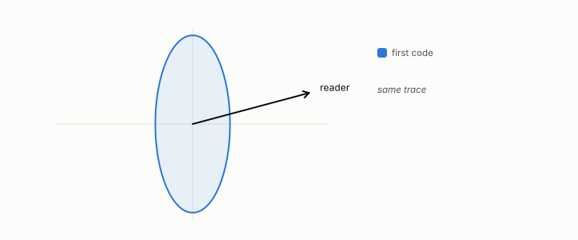

# read direction

**id.** read-direction
**kind.** concept

## definition

An eigenvector of the read operator with a nonzero eigenvalue, a direction the consumer is sensitive to. Chapter 2 section 2.2.

**Example.** For the consumer 3x1 + 4x2 the read direction is (3, 4) over 5.

## equation

none

## conditions

- An eigenvector of the read operator with a nonzero eigenvalue, a direction the consumer is sensitive to. An affine consumer has exactly one, its weight vector, the projection onto a read direction is idempotent, and its residual is orthogonal to it.
- The code that puts the whole error on the read direction is the worst, the control that destroys the read direction is confirmed worst, and no code of a given total error can be read as more than the total.

Conditions are curated in `entries.toml` rather than read from a record.

## ledger

none

## first stated

Chapter 2 section 2.2 and chapter 4 section 4.3 of *Data Mining as Observation*, with the control that destroys the read direction in `geometric-observation/chapters/ch08_value.md:40-70`.

## measurements

none

## failures and corrections

none

## invariance envelope

none declared

## machine checked

[`lean/DataMiningAsObservation/ReadOperator.lean`](https://github.com/ahb-sjsu/observation-data-mining/blob/f3914f0/lean/DataMiningAsObservation/ReadOperator.lean), theorems `rank_one_reads_one_direction`, `readOp_mulVec`, `quad_readOp`, `quad_readOp_nonneg`, `readOp_mulVec_eq_zero_iff`, `readOp_diag`, `readOp_offdiag`, `readOp_symm`, `readOp_neg`, `affine_const_along_nuisance`, `readOp_affine`, `readOp_sqLength_basis`, at observation-data-mining f3914f0; what the check covers is stated in the book's [appendix C](https://github.com/ahb-sjsu/observation-data-mining/blob/f3914f0/chapters/machine_checked.md).

[`lean/DataMiningAsObservation/Projection.lean`](https://github.com/ahb-sjsu/observation-data-mining/blob/f3914f0/lean/DataMiningAsObservation/Projection.lean), theorems `proj_proj`, `dot_sub_proj`, `proj_sq_le`, `proj_add_orth`, `proj_add`, at observation-data-mining f3914f0; what the check covers is stated in the book's [appendix C](https://github.com/ahb-sjsu/observation-data-mining/blob/f3914f0/chapters/machine_checked.md).

## used in

*Data Mining as Observation* chapters 2, 3, 4, 6, 8, 11, 12.

## related

read-subspace, read-operator, sensitivity, nuisance, projection

## see also

Book equations stated beside the entry's terms, not defining it: 0.9, 6.1, 4.2.

Ledger rows that cite the entry's records without naming it: GO-1, GO-2 (pos. half: consumer-projected covariance *controls*).

Sources-table rows that share a record with the entry without naming it: chapter 1 section 1.4, chapter 4 section 4.3, chapter 6 section 6.2, chapter 11 section 11.7.

## status

Generated 2026-09-12 by `encyclopedia/generate.py`; book at observation-data-mining f3914f0; the commit of every record is listed in the encyclopedia's provenance.
