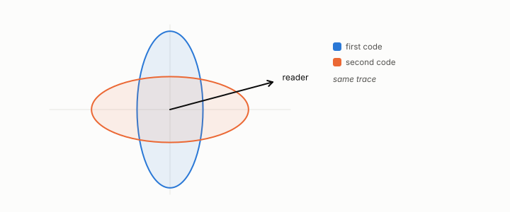

# read distortion

**id.** read-distortion
**kind.** concept

## definition

The error as a consumer experiences it, the trace of the read operator times the error's second-moment matrix, which is its covariance when the error is centered. For the identity reader it is mean squared error. Equation 0.10.

**Example.** A reader with operator diag(1, 0) charges a code with errors (0.3, 1.7) only 0.3.

**Known as, or related to prior art.** The consumer-weighted squared error. Task-based quantization studies the same objective for a known task.

## equation

none

## conditions

- Exact, with no centering, for a fixed read operator, which is the affine case. For a nonlinear consumer whose error depends on the row it is a first-order factorized surrogate, exact when the local operator and the error's outer product are uncorrelated across rows.
- The second-moment matrix of the error, not its covariance, unless the error is centered by construction.
- The trace of the second moment is the mean squared vector norm, which is the dimension times the per-coordinate mean squared error.

Conditions are curated in `entries.toml` rather than read from a record.

## ledger

none

## first stated

Volume 14, chapter 5, `geometric-observation/chapters/ch05_the_read_metric_and_the_quotient.md:49-75`, DOI 10.5281/zenodo.21776291, and chapter 2 of the same volume for the failure of observer-free measurement.

## measurements

| Where the book states it | Numbers, as the book's sources table records them | Source |
|---|---|---|
| chapter 2 section 2.2 | read distortion controls but is not a complete rank statistic, twelve of twelve, one middle pair misordered, NEG-9 | [`geometric-observation/chapters/ch05_the_read_metric_and_the_quotient.md:49-75`](https://github.com/ahb-sjsu/geometric-observation/blob/fc6b378/chapters/ch05_the_read_metric_and_the_quotient.md#L49-L75) |

## failures and corrections

none

## invariance envelope

**Boundary measured.**

- OD:closure-geometry, . Claim: For a filtered two-dimensional flow with the spectral cutoff as consumer and budget, the read operator of the resolved tendency with respect to the subfilter state, probed blind on the solver, has leading eigen-directions on which a closure predicts the resolved tendency better than the same number of energy-ranked modes; and the modes of largest read distortion (sensitivity times energy) close better than the energy ranking by a pooled margin at every rank. `experiments/DISCOVERY-TRACK.md, D7 record; experiments/OD/D7/grade.json`. Boundary: 96 rank cells on three fields at n = 96 and 128, cutoffs 8 and 16, ranks 16 to 128: the eigen-direction closure behind the energy closure in 87 cells, median 15 percent, up to 53; the read-distortion ranking ahead of energy pooled by 0.4, 0.7, 1.4 and 6.1 percent at ranks 16, 32, 64 and 128 against a margin of 1, never behind by more than 7.1 against a tolerance of 13; the margin 0.016 at n = 96 and 0.026 at n = 128; every structured closure below random; the full-rank linear read leaving 3.2 percent (median) to 9.2 percent of the subgrid term at cutoff 8 and nothing at 16. Witness: the leading eigen-directions of the read operator rank subfilter modes by the resolved dynamics' response alone, and the flow's energy is elsewhere; the read distortion, response times energy, is the quantity that ranks, and it beats energy by an amount that grows with rank and cutoff, which is where a closure keeps enough modes for sensitivity to separate them. Absorbed by: declaration. Revision: none registered; the track's declared order ends with this gate.

## machine checked

[`lean/DataMiningAsObservation/ReadDistortion.lean`](https://github.com/ahb-sjsu/observation-data-mining/blob/f3914f0/lean/DataMiningAsObservation/ReadDistortion.lean), theorems `read_distortion`, `identity_reader`, `quad_one`, at observation-data-mining f3914f0; what the check covers is stated in the book's [appendix C](https://github.com/ahb-sjsu/observation-data-mining/blob/f3914f0/chapters/machine_checked.md).

## used in

*Data Mining as Observation* primer L, chapters 1, 2, 4.

## related

flip, alignment, identity-reader, quotient

## see also

Book equations stated beside the entry's terms, not defining it: 0.10, 1.2, 4.1.

Ledger rows that cite the entry's records without naming it: GO-2 (pos. half: consumer-projected covariance *controls*).

Sources-table rows that share a record with the entry without naming it: chapter 1 section 1.4, chapter 2 section 2.2, chapter 4 section 4.3.

## status

Generated 2026-09-09 by `encyclopedia/generate.py`; book at observation-data-mining f3914f0; the commit of every record is listed in the encyclopedia's provenance.
