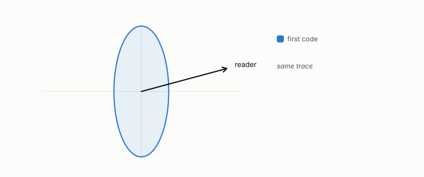

# read subspace

**id.** read-subspace
**kind.** concept

## definition

The directions of the data a consumer can distinguish, spanned by the eigenvectors of its read operator with nonzero eigenvalue. Chapter 0 section 0.5.

**Example.** The consumer 3x1 + 4x2 has a one-dimensional read subspace spanned by (3, 4).

**Known as, or related to prior art.** The active subspace of Constantine and Gleich when the output is scalar and Euclidean.

## equation

Book equation 0.9.

    P_C=\mathbb E\!\left[g\,g^{\top}\right],\qquad g=\nabla C(x).

Book equation 2.1.

    P_{C_2\circ C_1}(x)=J_1(x)^{\top}\,P_{C_2}\big(C_1(x)\big)\,J_1(x),\qquad \operatorname{rank}P_{C_2\circ C_1}(x)\le\operatorname{rank}P_{C_2}\big(C_1(x)\big)\quad\text{at each row } x.

Book equation 6.1.

    s(x)=w\cdot x+b,\qquad P_C=\mathbb E\big[\sigma'(s)^{2}\big]\,w\,w^{\top},\qquad \operatorname{rank}P_C=1.

## conditions

- The read subspace is spanned by the eigenvectors of the read operator with nonzero eigenvalue, and it is small. A linear classifier reads one direction, an attention head a handful, and the input has hundreds or thousands.
- Pointwise, a scalar-output consumer reads one direction at each row, and the averaged operator can still have full rank, as the consumer that reads the squared length of a row shows.
- Recovering it from a black box costs two consumer calls per input dimension per row and is a cliff at the full dimension.

Conditions are curated in `entries.toml` rather than read from a record.

## ledger

none

## first stated

Volume 14, chapter 5, `geometric-observation/chapters/ch05_the_read_metric_and_the_quotient.md:7-48`, DOI 10.5281/zenodo.21776291, where the read subspace is the range of the read operator.

## measurements

| Where the book states it | Numbers, as the book's sources table records them | Source |
|---|---|---|
| chapter 2 section 2.2 | read subspace small, operator local, pullback composition, rank cannot increase | [`geometric-observation/chapters/ch05_the_read_metric_and_the_quotient.md:7-48`](https://github.com/ahb-sjsu/geometric-observation/blob/d1f8988/chapters/ch05_the_read_metric_and_the_quotient.md#L7-L48); [`geometric-observation/chapters/ch06_mathematical_preliminaries.md:10-27`](https://github.com/ahb-sjsu/geometric-observation/blob/d1f8988/chapters/ch06_mathematical_preliminaries.md#L10-L27) |

## failures and corrections

none

## machine checked

[`lean/DataMiningAsObservation/ReadOperator.lean`](https://github.com/ahb-sjsu/observation-data-mining/blob/08b4794/lean/DataMiningAsObservation/ReadOperator.lean), theorems `rank_one_reads_one_direction`, `readOp_mulVec`, `quad_readOp`, `quad_readOp_nonneg`, `readOp_mulVec_eq_zero_iff`, `readOp_diag`, `readOp_offdiag`, `readOp_symm`, `readOp_neg`, `affine_const_along_nuisance`, `readOp_affine`, `readOp_sqLength_basis`, at observation-data-mining 08b4794; what the check covers is stated in the book's [appendix C](https://github.com/ahb-sjsu/observation-data-mining/blob/08b4794/chapters/machine_checked.md).

## used in

*Data Mining as Observation* chapters 0, 1, 2, 3, 4, 6, 7, 9, 10, 11, 12, 13.

## related

nuisance, read-operator, blind-probe, budget-cliff

## see also

Ledger rows that cite the entry's records without naming it: OT-3, NEG-12, GO-B-Llama, GO-B-Llama-rematch, GO-B-Llama-rematch.

Sources-table rows that share a record with the entry without naming it: chapter 2 section 2.2, chapter 6 section 6.2, chapter 11 section 11.7.

## status

Generated 2026-09-06 by `encyclopedia/generate.py`; book at observation-data-mining 08b4794; the commit of every record is listed in the encyclopedia's provenance.
