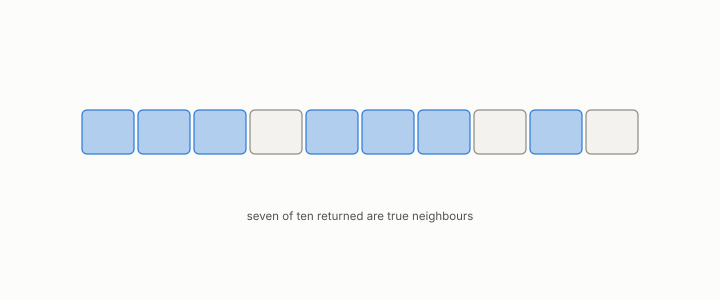

# recall at k

**id.** recall-at-k
**kind.** concept

## definition

The fraction of a query's true k nearest neighbours that an index returned. Equation 11.3.

**Example.** Returning 7 of a query's 10 true neighbours is recall at 10 of 0.7.

## equation

Book equation 11.3.

    \begin{gathered} \mathrm{recall}@k=\frac{\big|\text{returned top-}k\ \cap\ \text{true top-}k\big|}{k}, \\ \text{true top-}k\text{ computed from the uncompressed vectors}. \end{gathered}

## conditions

- The fraction of a query's true k nearest neighbours, computed from the uncompressed vectors, that the index returned. It lies in the unit interval and is one exactly when the returned list is the true list.
- The aggregate over queries is a weighted mean over strata, so a stratum that fails entirely moves it by no more than its weight. That is why the anti-hub stratum is reported on its own, and why aggregate recall is never an acceptance metric on its own.

Conditions are curated in `entries.toml` rather than read from a record.

## ledger

none

## first stated

Chapter 11 section 11.3 of *Data Mining as Observation*, with the program's stratified form in turboquant-pro, `turboquant-pro/docs/HUBNESS_PRIMER.md:86-131`.

## measurements

| Where the book states it | Numbers, as the book's sources table records them | Source |
|---|---|---|
| chapter 10 section 10.2 | anti-hubs as where compressed indexes fail first, aggregate recall barely moves | [`turboquant-pro/docs/HUBNESS_PRIMER.md:86-131`](https://github.com/ahb-sjsu/turboquant-pro/blob/856c4cb/docs/HUBNESS_PRIMER.md#L86-L131) |
| chapter 11 section 11.6 | anti-hub recall, p05, hub-rank correlation, hub-set overlap, the build gate | [`turboquant-pro/docs/HUBNESS_PRIMER.md:86-131`](https://github.com/ahb-sjsu/turboquant-pro/blob/856c4cb/docs/HUBNESS_PRIMER.md#L86-L131) |

## failures and corrections

none

## invariance envelope

none declared

## machine checked

[`lean/DataMiningAsObservation/RecallAtK.lean`](https://github.com/ahb-sjsu/observation-data-mining/blob/95af30c/lean/DataMiningAsObservation/RecallAtK.lean), theorems `recallAtK_mem_unit`, `recallAtK_eq_one_iff`, `aggregate_le_of_failing`, `aggregate_example`, at observation-data-mining 95af30c; what the check covers is stated in the book's [appendix C](https://github.com/ahb-sjsu/observation-data-mining/blob/95af30c/chapters/machine_checked.md).

## used in

*Data Mining as Observation* chapters 0, 10, 11, 12.

## related

anti-hub, min-over-strata, rank-certificate, hubness

## see also

Book equations stated beside the entry's terms, not defining it: 10.7.

Ledger rows that cite the entry's records without naming it: NEG-14, GO-B-Llama, GO-B-Llama-rematch.

Sources-table rows that share a record with the entry without naming it: chapter 3 section 3.5, chapter 10 section 10.3, chapter 11 section 11.6.

## status

Generated 2026-09-08 by `encyclopedia/generate.py`; book at observation-data-mining 95af30c; the commit of every record is listed in the encyclopedia's provenance.
