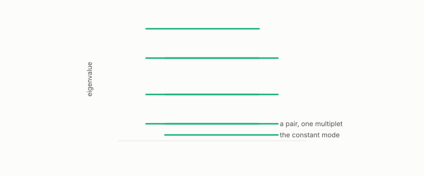

# recognizer

**id.** recognizer
**kind.** instrument

## definition

The instrument that decides whether a clustering certificate is right, wrong, or vacuous, by naming the manifold from the eigenvalue multiplets or certifying that none is present. Chapter 9.

**Example.** The ratios of the lowest eight eigenvalues matched the sphere template, and a shape matching no template was refused.

## equation

Book equation 9.2.

    N(\lambda)=\#\{k:\lambda_k\le\lambda\}\ \sim\ C_d\,\lambda^{d/2}\qquad\Rightarrow\qquad d=2\,\frac{d\log N}{d\log\lambda}.

## conditions

- The recognizer names a manifold from the low eigenvalue multiplets of a neighbourhood graph's Laplacian by template match, or certifies that none is present, and it can only name shapes in its template set.
- It was held to a preregistered held-out battery, and the vacuity threshold below which it certifies nothing is derived from the problem rather than tuned.
- The limitation applies to every spectral reading in the book. A finite graph spectrum names a shape only against a finite list of templates, and the manifold, multiplet, and Weyl's law entries carry the same scope.

Conditions are curated in `entries.toml` rather than read from a record.

## ledger

none

## first stated

Volume 14, chapter 11, `geometric-observation/chapters/ch11_the_recognizer.md:1-95`, DOI 10.5281/zenodo.21776291, and the-angular-observer's recognizer battery, `the-angular-observer/PREREG_RECOGNIZER_BATTERY.md:1-80`.

## measurements

| Where the book states it | Numbers, as the book's sources table records them | Source |
|---|---|---|
| chapter 9 section 9.2 | the recognizer's mechanism, low multiplets and angular distances, dimension before shape by Weyl's law, refusal, the growth gotcha | [`geometric-observation/chapters/ch11_the_recognizer.md:1-95`](https://github.com/ahb-sjsu/geometric-observation/blob/787a933/chapters/ch11_the_recognizer.md#L1-L95) |

## failures and corrections

none

## machine checked

[`lean/DataMiningAsObservation/Recognizer.lean`](https://github.com/ahb-sjsu/observation-data-mining/blob/95af30c/lean/DataMiningAsObservation/Recognizer.lean), theorems `templateDist_self`, `templateDist_comm`, `templateDist_scale`, `templateDist_nonneg`, at observation-data-mining 95af30c; what the check covers is stated in the book's [appendix C](https://github.com/ahb-sjsu/observation-data-mining/blob/95af30c/chapters/machine_checked.md).

## used in

*Data Mining as Observation* chapters 9.

## related

certificate, vacuity-threshold, hubness

## see also

Book equations stated beside the entry's terms, not defining it: 9.3, 0.32.

Ledger rows that cite the entry's records without naming it: GO-3.

Sources-table rows that share a record with the entry without naming it: chapter 3 section 3.3, chapter 9 section 9.1, chapter 9 section 9.2, chapter 9 section 9.3, chapter 11 section 11.1.

## status

Generated 2026-09-07 by `encyclopedia/generate.py`; book at observation-data-mining 95af30c; the commit of every record is listed in the encyclopedia's provenance.
