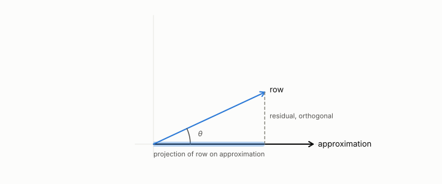

# reconstruction error

**id.** reconstruction-error
**kind.** concept

## definition

The squared length of the difference between a row and its approximation, the identity reader's distortion. Chapter 1 section 1.4.

**Example.** Approximating (3, 4) by (3, 0) costs reconstruction error 16.

## equation

none

## conditions

- The squared length of the difference between a row and its approximation, the identity reader's distortion. It is nonnegative, zero exactly when the approximation is the row, a sum of per-coordinate squared errors, and for a projection onto a unit direction it is the squared length less the squared component along it.
- A reconstruction cosine of 0.995 sat beside a perplexity of ten thousand, recalibration improved reconstruction and worsened the consumer, and at matched reconstruction the consumer-aware code won in twelve of twelve domains.

Conditions are curated in `entries.toml` rather than read from a record.

## ledger

- *measures.* GO-2 (neg. half: not reconstruction) `[demonstrated]`. At matched bits, downstream preservation is not controlled by reconstruction error. [`geometric-observation/claims/LEDGER.md:63`](https://github.com/ahb-sjsu/geometric-observation/blob/fc6b378/claims/LEDGER.md#L63).
- *measures.* GO-6 `[demonstrated]`. At matched rate, output coding ≤ surrogate ≤ reconstruction on the consumer metric; the output–reconstruction gap is governed by the $\ker P_C$ entropy share, and the surrogate–output gap vanishes as rate grows. [`geometric-observation/claims/LEDGER.md:68`](https://github.com/ahb-sjsu/geometric-observation/blob/fc6b378/claims/LEDGER.md#L68).

## first stated

Chapter 1 section 1.4 and chapter 4 section 4.1 of *Data Mining as Observation*, with the identity slice in `geometric-observation/chapters/ch02_failure_of_observer_free_measurement.md:1-40`.

## measurements

| Where the book states it | Numbers, as the book's sources table records them | Source |
|---|---|---|
| chapter 4 section 4.2 | GO-6, d 8 and r 4, output at or below surrogate at or below reconstruction at every rate, about 500 times, gap 0.41 to 0.005, isotropic control collapses | [`geometric-observation/claims/LEDGER.md`](https://github.com/ahb-sjsu/geometric-observation/blob/fc6b378/claims/LEDGER.md) row GO-6; [`geometric-observation/chapters/ch07_cost.md`](https://github.com/ahb-sjsu/geometric-observation/blob/fc6b378/chapters/ch07_cost.md) |

## failures and corrections

none

## invariance envelope

none declared

## machine checked

[`lean/DataMiningAsObservation/ReconstructionError.lean`](https://github.com/ahb-sjsu/observation-data-mining/blob/6aebdf3/lean/DataMiningAsObservation/ReconstructionError.lean), theorems `recon_nonneg`, `recon_eq_zero_iff`, `recon_sum`, `recon_proj`, at observation-data-mining 6aebdf3; what the check covers is stated in the book's [appendix C](https://github.com/ahb-sjsu/observation-data-mining/blob/6aebdf3/chapters/machine_checked.md).

[`lean/DataMiningAsObservation/ReadDistortion.lean`](https://github.com/ahb-sjsu/observation-data-mining/blob/6aebdf3/lean/DataMiningAsObservation/ReadDistortion.lean), theorems `read_distortion`, `identity_reader`, `quad_one`, at observation-data-mining 6aebdf3; what the check covers is stated in the book's [appendix C](https://github.com/ahb-sjsu/observation-data-mining/blob/6aebdf3/chapters/machine_checked.md).

## used in

*Data Mining as Observation* chapters 0, 1, 4, 6, 7, 8, 11, 12, 13.

## related

identity-reader, read-distortion, distortion, principal-component-analysis, flip-the

## see also

Book equations stated beside the entry's terms, not defining it: 4.2, 1.1, 0.5.

Ledger rows that cite the entry's records without naming it: NEG-4.

Sources-table rows that share a record with the entry without naming it: chapter 1 section 1.4, chapter 3 section 3.2.

## status

Generated 2026-09-09 by `encyclopedia/generate.py`; book at observation-data-mining 6aebdf3; the commit of every record is listed in the encyclopedia's provenance.
