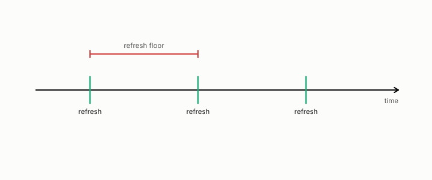

# refresh floor

**id.** refresh-floor
**kind.** correction

## definition

A claimed lower bound on how often a certificate must be renewed. The proportional-to-coherence-time version was refuted and replaced by a sealed horizon. Chapter 13.

**Example.** At 10 hertz Doppler the sealed refresh floor was 4 slots of one millisecond.

## equation

Book equation 13.2.

    \begin{gathered} T_{\mathrm{coh}}=\frac{0.423}{f_D}, \\ \text{refuted fit:}\ \ \phi\approx0.177\,T_{\mathrm{coh}}\ (R^{2}=0.915), \qquad \text{sealed:}\ \ \phi\le 6\ \text{TTI at }10\ \text{Hz},\ \ 1\ \text{TTI at}\ \ge50\ \text{Hz}. \end{gathered}

## conditions

- The proportional law, a floor of about 0.177 times the coherence time, was fit at a relaxed threshold against a fresh baseline that never met the budget. It is refuted, the record is kept, and it is not cited.
- The sealed replacement calibrated the baseline to the budget first and found floors of a few transmission intervals at 10 hertz and one at 50 hertz and above, with the optimal linear predictor unable to beat the one-coherence-time wall.
- Volume 14's book outline still cites the refuted law, an open item.

Conditions are curated in `entries.toml` rather than read from a record.

## ledger

- *refutes or corrects.* OT-4 `[refuted]`. Operator drift predicts a real long-generation degradation and a derived refresh intervention moves it. [`geometric-observation/claims/LEDGER.md:36`](https://github.com/ahb-sjsu/geometric-observation/blob/b2626a6/claims/LEDGER.md#L36).
- *refutes or corrects.* OT-11 `[void]`. Feedback-free staleness: streaming-retrieval damage tracks measured drift; derived-cadence re-allocation removes it. [`geometric-observation/claims/LEDGER.md:48`](https://github.com/ahb-sjsu/geometric-observation/blob/b2626a6/claims/LEDGER.md#L48).

## first stated

An unsealed exploration in the radio freshness track, `observation-theory-campaigns/analysis/csi/CSI-refreshfloor.json`, refuted and replaced by the sealed sweep `observation-theory-campaigns/analysis/csi/PREREG-XPROTO-CSI-SWEEP2.md`.

## measurements

| Where the book states it | Numbers, as the book's sources table records them | Source |
|---|---|---|
| chapter 13 section 13.3 | BGP 0.351, IS-IS 0.184, OSPF 0.083, second collector | [`observation-theory-campaigns/analysis/mongo/PREREG-XPROTO-MG.md:42`](https://github.com/ahb-sjsu/observation-theory-campaigns/blob/6576e06/analysis/mongo/PREREG-XPROTO-MG.md#L42); [`observation-theory-campaigns/experiments/ROUTING-TELEMETRY-TRACK.md:130-150`](https://github.com/ahb-sjsu/observation-theory-campaigns/blob/6576e06/experiments/ROUTING-TELEMETRY-TRACK.md#L130-L150); [`geometric-observation/BOOK-OUTLINE.md:75`](https://github.com/ahb-sjsu/geometric-observation/blob/b2626a6/BOOK-OUTLINE.md#L75) |
| chapter 13 section 13.3 | radio 0.27 to 0.42 naive to 0.055 to 0.13, neural reconstruction 0.28 to 0.13 | [`observation-theory-campaigns/experiments/RADIO-FRESHNESS-TRACK.md:20-35`](https://github.com/ahb-sjsu/observation-theory-campaigns/blob/6576e06/experiments/RADIO-FRESHNESS-TRACK.md#L20-L35) |
| chapter 13 section 13.4 | refuted fit 0.177 T_coh R² 0.915, 0.15 threshold vs 0.10 claim, fresh baseline 0.113, do not cite | `observation-theory-campaigns\analysis\csi\CSI-refreshfloor.json:2,111-114`; [`observation-theory-campaigns/experiments/RADIO-FRESHNESS-TRACK.md:41-47`](https://github.com/ahb-sjsu/observation-theory-campaigns/blob/6576e06/experiments/RADIO-FRESHNESS-TRACK.md#L41-L47) |
| chapter 13 section 13.4 | sealed correction, 0.5 dB calibration, floors 4/6/4, 2/2/3, 1, slopes 0.1008, 0.1398, 0.1086, R² 0.7376, 0.9218, 0.6174, bars B1 to B4 and MC1 to MC4 all true, seeds 20260827 to 20260829, sealed 1d3de4a | [`observation-theory-campaigns/analysis/csi/PREREG-XPROTO-CSI-SWEEP2.md:1-60`](https://github.com/ahb-sjsu/observation-theory-campaigns/blob/6576e06/analysis/csi/PREREG-XPROTO-CSI-SWEEP2.md#L1-L60); [`observation-theory-campaigns/analysis/csi/XPROTO-CSI-SWEEP2-graded.json`](https://github.com/ahb-sjsu/observation-theory-campaigns/blob/6576e06/analysis/csi/XPROTO-CSI-SWEEP2-graded.json); [`observation-theory-campaigns/experiments/SEALS.md:90`](https://github.com/ahb-sjsu/observation-theory-campaigns/blob/6576e06/experiments/SEALS.md#L90) |
| chapter 13 section 13.4 | freshness sweep classes, sensing refuted at about 1.6 times | [`geometric-observation/BOOK-OUTLINE.md:70-90`](https://github.com/ahb-sjsu/geometric-observation/blob/b2626a6/BOOK-OUTLINE.md#L70-L90) |

## failures and corrections

- OT-4, `[refuted]`. Operator drift predicts a real long-generation degradation and a derived refresh intervention moves it. [`geometric-observation/claims/LEDGER.md:36`](https://github.com/ahb-sjsu/geometric-observation/blob/b2626a6/claims/LEDGER.md#L36).
- OT-11, `[void]`. Feedback-free staleness: streaming-retrieval damage tracks measured drift; derived-cadence re-allocation removes it. [`geometric-observation/claims/LEDGER.md:48`](https://github.com/ahb-sjsu/geometric-observation/blob/b2626a6/claims/LEDGER.md#L48).
- [`observation-theory-campaigns/experiments/RADIO-FRESHNESS-TRACK.md:41-50`](https://github.com/ahb-sjsu/observation-theory-campaigns/blob/6576e06/experiments/RADIO-FRESHNESS-TRACK.md#L41-L50) at 6576e06. **The age horizon** (`analysis/csi/`, XPROTO-CSI-SWEEP2 sealed 2026-08-27, graded PASS): at the calibrated 0.10 budget the largest compliant report period is a few TTI at 10 Hz and 1 TTI at 50 Hz and above, so there is no proportionality law to fit. The earlier `CSI-refreshfloor.*` claim of a floor ≈ 0.177·T_coh (R²=0.915) was an **unsealed exploration** measured at a relaxed 0.15 threshold against the 0.10 target, with a fresh baseline that never met the budget. It is refuted; the record is kept, not cited. Separately, the optimal linear predictor cannot beat the one-coherence-time wall (Gaussian fading → Wiener optimal), and that wall sits well outside the budget horizon. The **RAN governor** (`analysis/ran`) is the reference O-RAN rApp core: observe→measure false-clear→refresh at the floor→escalate (diversity / re-route).

## invariance envelope

none declared

## machine checked

[`lean/DataMiningAsObservation/CoherenceTime.lean`](https://github.com/ahb-sjsu/observation-data-mining/blob/f3914f0/lean/DataMiningAsObservation/CoherenceTime.lean), theorems `clarke_to_three_decimals`, `examples`, `refuted_law_exceeds_sealed`, at observation-data-mining f3914f0; what the check covers is stated in the book's [appendix C](https://github.com/ahb-sjsu/observation-data-mining/blob/f3914f0/chapters/machine_checked.md).

## used in

*Data Mining as Observation* chapters 0, 13.

## related

coherence-time, certificate, false-clear-rate

## see also

none

## status

Generated 2026-09-12 by `encyclopedia/generate.py`; book at observation-data-mining f3914f0; the commit of every record is listed in the encyclopedia's provenance.
