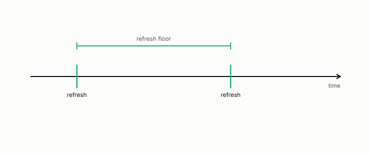

# refresh interval

**id.** refresh-interval
**kind.** instrument

## definition

The longest renewal period that keeps a certificate within its promised error, a measured property of the system and not a convention. Chapter 13.

## equation

Book equation 13.2.

    \begin{gathered} T_{\mathrm{coh}}=\frac{0.423}{f_D}, \\ \text{refuted fit:}\ \ \phi\approx0.177\,T_{\mathrm{coh}}\ (R^{2}=0.915), \qquad \text{sealed:}\ \ \phi\le 6\ \text{TTI at }10\ \text{Hz},\ \ 1\ \text{TTI at}\ \ge50\ \text{Hz}. \end{gathered}

## conditions

- The longest renewal period that keeps a certificate within its promised error, a measured property of the system and not a convention. A certificate older than the interval is stale for every consumer whose floor is shorter, and the floors are counted in slots that add over consecutive durations.
- There is no proportionality law between the interval and the coherence time. The fit of the floor as 0.177 of the coherence time was refuted and is not to be cited, and the sealed floors were 4, 1, and 1 slots at 10, 50, and 400 hertz.

Conditions are curated in `entries.toml` rather than read from a record.

## ledger

none

## first stated

Chapter 13 section 13.2 of *Data Mining as Observation*, with the sealed floors in `observation-theory-campaigns/experiments/RADIO-FRESHNESS-TRACK.md:20-35` and the refuted fit in `observation-theory-campaigns/analysis/csi/CSI-refreshfloor.json`.

## measurements

none

## failures and corrections

none

## machine checked

`lean/DataMiningAsObservation/CoherenceTime.lean`, theorems `clarke_to_three_decimals`, `examples`, `refuted_law_exceeds_sealed`, at observation-data-mining 08b4794.

`lean/DataMiningAsObservation/TTI.lean`, theorems `slots_of_ms`, `slots_add`, `slots_mono`, `slots_coherence`, at observation-data-mining 08b4794.

## used in

*Data Mining as Observation* chapters 13, 14.

## related

refresh-floor, coherence-time, certificate, false-clear-rate, transmission-time-interval

## see also

Book equations stated beside the entry's terms, not defining it: 0.25, 0.26.

Ledger rows that cite the entry's records without naming it: OT-4.

Sources-table rows that share a record with the entry without naming it: chapter 13 section 13.3, chapter 13 section 13.4.

## status

Generated 2026-09-06 by `encyclopedia/generate.py`; book at observation-data-mining 08b4794; the commit of every record is listed in the encyclopedia's provenance.
