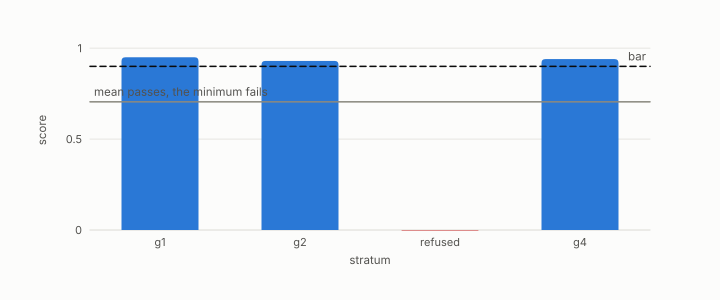

# refusal

**id.** refusal
**kind.** concept

## definition

An instrument's declining to report a number it cannot support. A refusal is a verdict, and it is counted. Chapter 2 section 2.4 and chapter 9 section 9.2.

**Example.** The probe refused to report when 16 samples in 128 dimensions could not resolve rank fifteen.

## equation

none

## conditions

- An instrument's declining to report a number it cannot support, when samples do not exceed the dimension, when no template matches, or when a group is too thin. A refusal is a verdict, it is counted, and a mean never hides it.
- The recognizer refuses when the ratios match no stored template, the probe refuses to extrapolate past its fit range, and the strata design refuses rather than warns.

Conditions are curated in `entries.toml` rather than read from a record.

## ledger

none

## first stated

Chapter 2 section 2.4 and chapter 9 section 9.2 of *Data Mining as Observation*, with the refusal regimes in `readscope/readscope/regimes.py:1-60`.

## measurements

| Where the book states it | Numbers, as the book's sources table records them | Source |
|---|---|---|
| chapter 2 section 2.3 | refusal regimes, selection consumers read order, recurrences compound | [`readscope/readscope/regimes.py:1-60`](https://github.com/ahb-sjsu/readscope/blob/856e678/readscope/regimes.py#L1-L60) |
| chapter 10 section 10.4 | area map, boundary rule, hash, refuse not warn, intra and transit counts, area classes, abstention rule | [`turboquant-pro/docs/STRATA_RFC.md:24-98`](https://github.com/ahb-sjsu/turboquant-pro/blob/856c4cb/docs/STRATA_RFC.md#L24-L98) |

## failures and corrections

none

## machine checked

[`lean/DataMiningAsObservation/Abstention.lean`](https://github.com/ahb-sjsu/observation-data-mining/blob/95af30c/lean/DataMiningAsObservation/Abstention.lean), theorems `abstain_not_passes`, `verdict_eq_none_iff`, `passes_verdict_iff`, `inf_le_of_subset`, at observation-data-mining 95af30c; what the check covers is stated in the book's [appendix C](https://github.com/ahb-sjsu/observation-data-mining/blob/95af30c/chapters/machine_checked.md).

## used in

*Data Mining as Observation* chapters 2, 8, 9, 10, 11, 14.

## related

abstention, vacuity-threshold, recognizer, verdict, coverage

## see also

Book equations stated beside the entry's terms, not defining it: 10.7, 14.4, 9.3.

Ledger rows that cite the entry's records without naming it: GO-3, NEG-14.

Sources-table rows that share a record with the entry without naming it: chapter 2 section 2.6, chapter 6 section 6.1, chapter 10 section 10.4.

## status

Generated 2026-09-07 by `encyclopedia/generate.py`; book at observation-data-mining 95af30c; the commit of every record is listed in the encyclopedia's provenance.
