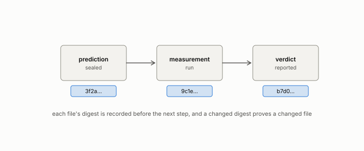

# registered

**id.** registered
**kind.** concept

## definition

Of a claim, bar, null, or budget, written into a sealed file before the measurement. Chapter 8 section 8.8.

**Example.** The bar of 0.90 for anti-hub recall was registered before the compressed index was scored.

## equation

none

## conditions

- Of a claim, bar, null, or budget, written into a sealed file before the measurement, so that a changed digest would prove a changed prediction. A registered bar discriminates only when the null fails it and the real system passes it.
- A registered miss is kept as a miss, an identifier burned at pilot is not reused, and every number in the book was registered before it was measured or is labelled as not having been.
- Registration proves what was claimed and not when, and its chronology rests on the seal's public receipt, signed tag, or archival deposit.

Conditions are curated in `entries.toml` rather than read from a record.

## ledger

none

## first stated

Chapter 8 section 8.8 of *Data Mining as Observation*, with the template in `observation-theory-campaigns/experiments/PREREG-TEMPLATE.md:1-71` and the seal rule in `observation-theory-campaigns/experiments/SEALS.md:1-10`.

## measurements

none

## failures and corrections

none

## invariance envelope

none declared

## machine checked

[`lean/DataMiningAsObservation/Seal.lean`](https://github.com/ahb-sjsu/observation-data-mining/blob/95af30c/lean/DataMiningAsObservation/Seal.lean), theorems `changed_of_hash_ne`, `hash_eq_of_eq`, `exists_collision`, at observation-data-mining 95af30c; what the check covers is stated in the book's [appendix C](https://github.com/ahb-sjsu/observation-data-mining/blob/95af30c/chapters/machine_checked.md).

[`lean/DataMiningAsObservation/Bar.lean`](https://github.com/ahb-sjsu/observation-data-mining/blob/95af30c/lean/DataMiningAsObservation/Bar.lean), theorems `passes_anti`, `passes_mono`, `discriminates_iff`, `no_bar_of_null_ge`, `exists_bar_of_lt`, `vacuous_of_null_passes`, at observation-data-mining 95af30c; what the check covers is stated in the book's [appendix C](https://github.com/ahb-sjsu/observation-data-mining/blob/95af30c/chapters/machine_checked.md).

## used in

*Data Mining as Observation* chapters 1, 2, 3, 4, 5, 6, 7, 8, 9, 10, 11, 12, 13, 14.

## related

preregistration, sealed, bar, ledger-class, declaration

## see also

Book equations stated beside the entry's terms, not defining it: 8.1, 8.3.

Ledger rows that cite the entry's records without naming it: GO-1, GO-3, NEG-11.

Sources-table rows that share a record with the entry without naming it: chapter 8 section 8.8, chapter 9 section 9.2.

## status

Generated 2026-09-08 by `encyclopedia/generate.py`; book at observation-data-mining 95af30c; the commit of every record is listed in the encyclopedia's provenance.
