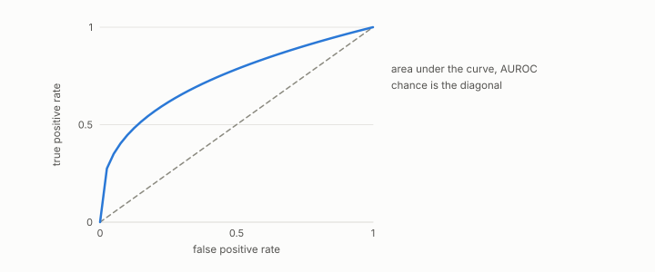

# reliability weight

**id.** reliability-weight
**kind.** concept

## definition

Zero or twice a validated encoder's held-out AUROC minus one, whichever is larger, used as that encoder's authority. It is a discrimination weight, unchanged by increasing transforms of the score and not by decreasing ones, and the calibration evidence is the expected calibration error reported beside it. Equation 0.38.

**Example.** A held-out AUROC of 0.8035 gives reliability weight 0.607, and an AUROC of 0.45 gives zero.

## equation

Book equation 0.38.

    w=\max\big(0,\ 2\cdot\mathrm{AUROC}-1\big).

## conditions

- Zero or twice the held-out AUROC minus one, whichever is larger. It is a discrimination weight, unchanged by a strictly increasing transform of the encoder's score and not by a decreasing one, which sends A to 1 minus A and the weight to zero whenever A was above one half.
- The calibration evidence is the expected calibration error reported beside it, and the weight is computed on a held-out split under the cross-corpus gate, so it is one formula from one source.

Conditions are curated in `entries.toml` rather than read from a record.

## ledger

none

## first stated

The moral-embedding program's calibrated authority, `gtc-prototype/docs/CALIBRATED_AUTHORITY.md:19-63` and `xbse/README.md:175-195`, and chapter 12 section 12.5 and chapter 14 section 14.2 of *Data Mining as Observation*.

## measurements

| Where the book states it | Numbers, as the book's sources table records them | Source |
|---|---|---|
| chapter 12 section 12.5 | ECE 0.018 to 0.101 vs raw up to 0.223, reliability weight, audit binding | `xbse/README.md:175-195`; [`gtc-prototype/docs/CALIBRATED_AUTHORITY.md:19-63`](https://github.com/ahb-sjsu/gtc-prototype/blob/c754bc5/docs/CALIBRATED_AUTHORITY.md#L19-L63) |
| chapter 14 section 14.2 | reliability weights and calibration errors per axis, the collapsed family's mean weight 0.559 against the general valence channel's own 0.735, the three design rules, 0.048 to 0.049 and 0.089 to 0.101 at 696 pairs | [`gtc-prototype/docs/CALIBRATED_AUTHORITY.md:1-65`](https://github.com/ahb-sjsu/gtc-prototype/blob/c754bc5/docs/CALIBRATED_AUTHORITY.md#L1-L65) |

## failures and corrections

none

## invariance envelope

none declared

## machine checked

[`lean/DataMiningAsObservation/ReliabilityWeight.lean`](https://github.com/ahb-sjsu/observation-data-mining/blob/a0db6a8/lean/DataMiningAsObservation/ReliabilityWeight.lean), theorems `pair_le_one`, `aurocNum_le`, `auroc_le_one`, `weight_mem_unit`, `weight_eq_zero_of_le_half`, `weight_comp`, at observation-data-mining a0db6a8; what the check covers is stated in the book's [appendix C](https://github.com/ahb-sjsu/observation-data-mining/blob/a0db6a8/chapters/machine_checked.md).

## used in

*Data Mining as Observation* chapters 0, 12, 14.

## related

monotone-invariance, harness, posited-versus-measured, certificate

## see also

Book equations stated beside the entry's terms, not defining it: 0.16.

## status

Generated 2026-09-09 by `encyclopedia/generate.py`; book at observation-data-mining a0db6a8; the commit of every record is listed in the encyclopedia's provenance.
