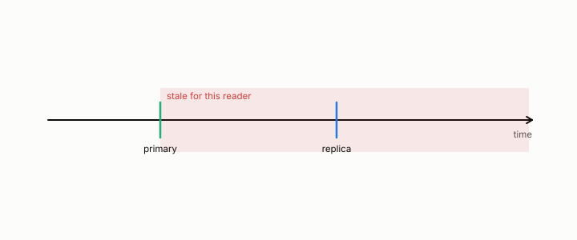

# replica

**id.** replica
**kind.** concept

## definition

A copy of a database kept on another machine. Its lag is how far it trails the primary. Chapter 13.

**Example.** A replica 50 writes behind the primary returns the old value for those 50 rows.

## equation

Book equation 0.26.

    \mathrm{FC}=\Pr\big[W\ \text{refutes}\ \big|\ \mathcal C_t\ \text{clears}\big],\qquad \text{coverage}=\Pr\big[\mathcal C_t\ \text{clears}\big].

## conditions

- A copy of a database kept on another machine, trailing the primary by a lag. The keys stale under a lag grow with the lag and vanish at no lag. A naive certificate that clears every read has coverage one and a false-clear rate equal to the stale fraction, and a witness-backed certificate that clears only keys outside the lag has a false-clear rate of zero at the price of coverage.
- Which reads are stale is consumer-relative, since two readers of the same replica have different coherence times, and the measured false-clear rates on ZooKeeper, Postgres, and MongoDB are the ledger's numbers.

Conditions are curated in `entries.toml` rather than read from a record.

## ledger

none

## first stated

Chapter 13 section 13.3 of *Data Mining as Observation*, with the program's substrate measurements in `observation-theory-campaigns/analysis/mongo/PREREG-XPROTO-MG.md` and the database rows of the freshness track.

## measurements

none

## failures and corrections

none

## machine checked

[`lean/DataMiningAsObservation/Replica.lean`](https://github.com/ahb-sjsu/observation-data-mining/blob/08b4794/lean/DataMiningAsObservation/Replica.lean), theorems `stale_mono`, `stale_zero`, `naive_certificate`, `witnessed_certificate`, `witnessed_coverage`, at observation-data-mining 08b4794; what the check covers is stated in the book's [appendix C](https://github.com/ahb-sjsu/observation-data-mining/blob/08b4794/chapters/machine_checked.md).

## used in

*Data Mining as Observation* chapters 1, 4, 13.

## related

freshness, certificate, witness, false-clear-rate, coverage

## see also

Book equations stated beside the entry's terms, not defining it: 13.1.

Ledger rows that cite the entry's records without naming it: OT-11.

Sources-table rows that share a record with the entry without naming it: chapter 13 section 13.3.

## status

Generated 2026-09-06 by `encyclopedia/generate.py`; book at observation-data-mining 08b4794; the commit of every record is listed in the encyclopedia's provenance.
