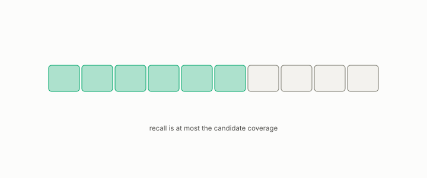

# rerank

**id.** rerank
**kind.** instrument

## definition

Reordering a candidate list with a second scorer. Its recall is at most the candidate coverage. Chapter 10 section 10.5.

**Example.** Reranking 100 candidates that hold 70 of the true neighbours can reach recall 0.7 and no more.

## equation

none

## conditions

- Reordering a candidate list with a second scorer. A rerank cannot return a row the list does not hold, so its recall is at most the candidate coverage, an oracle rerank reaches the coverage exactly, and a deeper list can only raise the coverage.
- Reranking the compressed candidates read 0.6627, identical to the unreranked recall, because candidate coverage was the wall, and the depth curve from 51 to 501 moved coverage from 0.696 to 0.926.

Conditions are curated in `entries.toml` rather than read from a record.

## ledger

none

## first stated

Chapter 10 section 10.5 of *Data Mining as Observation*, with the candidate-coverage finding in `turboquant-pro/docs/RESULTS_strata_phase23_gates.md`.

## measurements

| Where the book states it | Numbers, as the book's sources table records them | Source |
|---|---|---|
| chapter 10 section 10.5 | rerank identical 0.6627, candidate coverage, depth curve 51 to 501, coverage 0.696 to 0.926, fidelity 0.663 to 0.702, originals rerank 0.923, 4096 bytes on 148 | [`turboquant-pro/docs/RESULTS_strata_phase23_gates.md:45-110`](https://github.com/ahb-sjsu/turboquant-pro/blob/856c4cb/docs/RESULTS_strata_phase23_gates.md#L45-L110) |

## failures and corrections

none

## invariance envelope

none declared

## machine checked

[`lean/DataMiningAsObservation/Rerank.lean`](https://github.com/ahb-sjsu/observation-data-mining/blob/c149a10/lean/DataMiningAsObservation/Rerank.lean), theorems `hits_le_coverage`, `recall_le_coverage`, `oracle_rerank`, `coverage_mono`, at observation-data-mining c149a10; what the check covers is stated in the book's [appendix C](https://github.com/ahb-sjsu/observation-data-mining/blob/c149a10/chapters/machine_checked.md).

## used in

*Data Mining as Observation* chapters 4, 10, 11, 12.

## related

recall-at-k, anti-hub-recall, inverted-file, rank-certificate, retrieval-augmented-pipeline

## see also

Book equations stated beside the entry's terms, not defining it: 11.3, 10.7, 12.3.

Ledger rows that cite the entry's records without naming it: NEG-14, GO-B-Llama, GO-B-Llama-rematch.

Sources-table rows that share a record with the entry without naming it: chapter 4 section 4.5, chapter 10 section 10.4, chapter 10 section 10.5, chapter 11 section 11.4, chapter 12 section 12.4.

## status

Generated 2026-09-09 by `encyclopedia/generate.py`; book at observation-data-mining c149a10; the commit of every record is listed in the encyclopedia's provenance.
