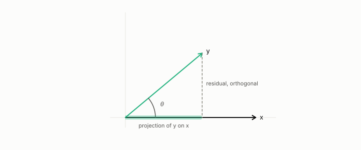

# residualization

**id.** residualization
**kind.** instrument

## definition

Removing from a column the least-squares multiple of another. The residual is orthogonal to the column removed. Chapter 8 section 8.6 and chapter 12 section 12.5.

**Example.** Removing the least-squares multiple of (1, 1) from (3, 1) leaves (1, −1), which is orthogonal to (1, 1).

## equation

none

## conditions

- Removing from a column the least-squares multiple of another. The residual is orthogonal to the column removed, its squared length is the original less the squared dot product over the removed column's squared length, a column orthogonal to the removed one is unchanged, and a column residualized on itself vanishes.
- Whether named categories survive residualization on the general valence channel is chapter 12's test, and the book-length signal fell from 0.241 to a residual 0.093 at six and a half standard errors.

Conditions are curated in `entries.toml` rather than read from a record.

## ledger

none

## first stated

Chapter 8 section 8.6 and chapter 12 section 12.5 of *Data Mining as Observation*, with the bifactor readout in `xbse/docs/BIFACTOR_READOUT.md:14-100`.

## measurements

| Where the book states it | Numbers, as the book's sources table records them | Source |
|---|---|---|
| chapter 8 section 8.6 | books 0.241 at 17 sigma, residual 0.093, R2 0.009, z 6.5, p 5.7e-11, 85 percent, fiction 0.131 on 2250 | `geometric-aesthetics/book/src/chapter-17-empirical-evidence-for-geometric-aesthetics.md:95-106` |

## failures and corrections

none

## invariance envelope

none declared

## machine checked

[`lean/DataMiningAsObservation/Residual.lean`](https://github.com/ahb-sjsu/observation-data-mining/blob/f3914f0/lean/DataMiningAsObservation/Residual.lean), theorems `residual_orth`, `residual_sq`, `residual_of_orth`, `residual_self`, at observation-data-mining f3914f0; what the check covers is stated in the book's [appendix C](https://github.com/ahb-sjsu/observation-data-mining/blob/f3914f0/chapters/machine_checked.md).

## used in

*Data Mining as Observation* primer L, chapters 8, 12, 14.

## related

correlation, orthogonal, confound, contraction, projection

## see also

Book equations stated beside the entry's terms, not defining it: 0.1, 12.3, 14.2.

Ledger rows that cite the entry's records without naming it: GO-B-legal (035→036).

Sources-table rows that share a record with the entry without naming it: chapter 8 section 8.6, chapter 12 section 12.5, chapter 14 section 14.8.

## status

Generated 2026-09-09 by `encyclopedia/generate.py`; book at observation-data-mining f3914f0; the commit of every record is listed in the encyclopedia's provenance.
