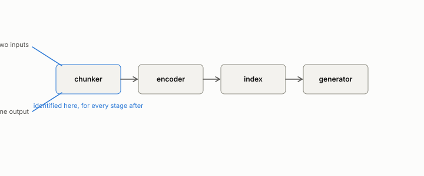

# retrieval-augmented pipeline

**id.** retrieval-augmented-pipeline
**kind.** concept

## definition

A system that answers a question by chunking documents, embedding the chunks, indexing them, retrieving the nearest to the embedded question, and handing them to a generator. A chain of observers. Chapter 12.

**Example.** Chunker, encoder, index, generator: a query becomes a vector, the vector a candidate list, and the list with the question an answer.

## equation

Book equation 12.1.

    \begin{gathered} x\sim_{\text{stage}} x'\ \Longrightarrow\ x\sim_{\text{pipeline}} x'\quad\text{for every stage, differentiable or not}, \\ \operatorname{rank}P_{\text{run}}(x)\le\min_{\text{stages in the run}}\operatorname{rank}J_{\text{stage}}(x)\quad\text{on a differentiable run of stages, at each row.} \end{gathered}

## conditions

- A system that chunks documents, embeds the chunks, indexes them, retrieves the nearest to the embedded question, and hands them to a generator. Whatever one stage declares the same, every later stage and the pipeline declare the same, and for linear stages the rank of the composition is at most the rank of any stage, so the pipeline's read subspace is no larger than its narrowest stage's.
- Both hold for every stage, differentiable or not. The benchmark score of the whole is a certificate whose false-clear rate on deployment slices is the chapter's measurement.

Conditions are curated in `entries.toml` rather than read from a record.

## ledger

none

## first stated

Chapter 12 of *Data Mining as Observation*, with the program's streaming-retrieval staleness row OT-11 and the legal-citation retrieval flip.

## measurements

none

## failures and corrections

none

## invariance envelope

none declared

## machine checked

[`lean/DataMiningAsObservation/Pipeline.lean`](https://github.com/ahb-sjsu/observation-data-mining/blob/f3914f0/lean/DataMiningAsObservation/Pipeline.lean), theorems `quotient_inherited`, `quotient_inherited_chain`, `rank_comp_le_first`, `rank_comp_le_second`, at observation-data-mining f3914f0; what the check covers is stated in the book's [appendix C](https://github.com/ahb-sjsu/observation-data-mining/blob/f3914f0/chapters/machine_checked.md).

## used in

*Data Mining as Observation* chapters 0, 1, 2, 3, 8, 10, 11, 12, 13, 14.

## related

quotient, read-subspace, deployment-mismatch, freshness

## see also

Book equations stated beside the entry's terms, not defining it: 13.1.

Ledger rows that cite the entry's records without naming it: OT-11, GO-B-legal (035→036).

Sources-table rows that share a record with the entry without naming it: chapter 12 section 12.3, chapter 12 section 12.6.

## status

Generated 2026-09-12 by `encyclopedia/generate.py`; book at observation-data-mining f3914f0; the commit of every record is listed in the encyclopedia's provenance.
