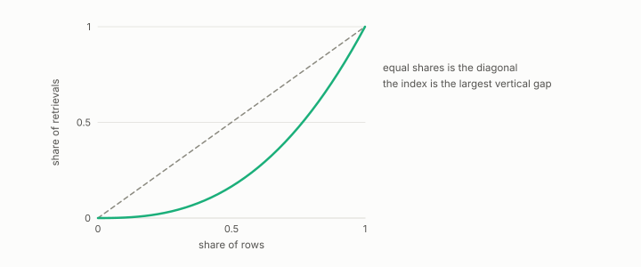

# Robin Hood index

**id.** robin-hood-index
**kind.** instrument

## definition

The fraction of a total count that would have to move from points above the mean to points below it to make every count equal. Equation 0.35.

**Example.** If 20 percent of the rows take 60 percent of the retrievals, the Robin Hood index is 0.40.

## equation

Book equation 0.35.

    \mathrm{RH}=\sum_i\max\!\Big(0,\ \frac{N_i}{\sum_j N_j}-\frac1n\Big).

## conditions

- The fraction of the total count that would have to move from points above the mean to points below it to make every count equal, the excess above the mean over the total, which is half the total absolute deviation over the total. It is nonnegative, zero exactly at equality, at most one, and unchanged by a common scaling of the counts.
- The strata design reports it per area beside the skew, and the first run's ratio of 1.30 against a bar of 1.5 is the number the abstention rule was written around.

Conditions are curated in `entries.toml` rather than read from a record.

## ledger

none

## first stated

Hoover's index of concentration, applied to neighbour counts in turboquant-pro's strata design, `turboquant-pro/docs/STRATA_RFC.md:24-98`, and chapter 0 section 0.16 of *Data Mining as Observation*.

## measurements

none

## failures and corrections

none

## machine checked

[`lean/DataMiningAsObservation/RobinHood.lean`](https://github.com/ahb-sjsu/observation-data-mining/blob/08b4794/lean/DataMiningAsObservation/RobinHood.lean), theorems `sum_dev`, `excess_eq_half_abs`, `robinHood_nonneg`, `robinHood_eq_zero_iff`, `robinHood_le_one`, `robinHood_scale`, at observation-data-mining 08b4794; what the check covers is stated in the book's [appendix C](https://github.com/ahb-sjsu/observation-data-mining/blob/08b4794/chapters/machine_checked.md).

## used in

*Data Mining as Observation* chapters 0, 10.

## related

hubness, anti-hub, poisson-ceiling, abstention

## see also

Book equations stated beside the entry's terms, not defining it: 10.4.

Ledger rows that cite the entry's records without naming it: NEG-14.

Sources-table rows that share a record with the entry without naming it: chapter 10 section 10.4.

## status

Generated 2026-09-06 by `encyclopedia/generate.py`; book at observation-data-mining 08b4794; the commit of every record is listed in the encyclopedia's provenance.
