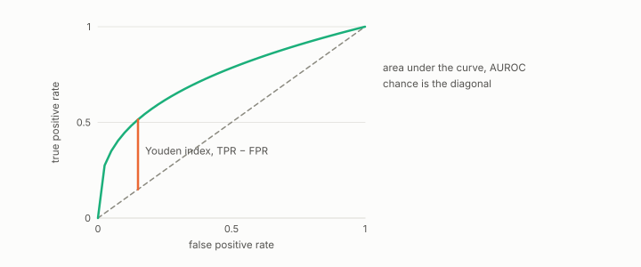

# ROC curve

**id.** roc-curve
**kind.** instrument

## definition

The path of true positive rate against false positive rate as the threshold sweeps, whose area is the AUROC. Chapter 5 section 5.4.

**Example.** A score with true positive rate 0.75 at false positive rate 0.25 traces one point of the curve, and the sweep of thresholds traces the rest.

## equation

Book equation 5.4.

    \begin{gathered} F_1^{\max}\ \le\ \sup_{t\in[J,\,1]}\ \frac{2t\pi}{t\pi+\pi+(t-J)(1-\pi)},\qquad J=\max_{\tau}\big(\mathrm{TPR}-\mathrm{FPR}\big),\qquad \pi=\text{prevalence}, \\ J\le 2A-1\ \text{when the ROC curve is concave, and not in general.} \end{gathered}

Book equation 0.38.

    w=\max\big(0,\ 2\cdot\mathrm{AUROC}-1\big).

## conditions

- The path of true positive rate against false positive rate as the threshold sweeps. Its area is the AUROC, which lies in the unit interval, is one half for a constant score, is one for a perfect ranking, and is unchanged by any strictly increasing transform of the score.
- The bound from AUROC to the best F1 through the Youden index holds for concave curves and not for every curve, with the counterexample at AUROC 0.75, and the book corrects the source on that point.

Conditions are curated in `entries.toml` rather than read from a record.

## ledger

none

## first stated

Chapter 5 section 5.4 of *Data Mining as Observation*, with the Youden ceiling and its correction to concave curves in `theory-radar/paper/astar_paper.tex:94-110`.

## measurements

none

## failures and corrections

none

## machine checked

[`lean/DataMiningAsObservation/Auroc.lean`](https://github.com/ahb-sjsu/observation-data-mining/blob/95af30c/lean/DataMiningAsObservation/Auroc.lean), theorems `pair_nonneg`, `auroc_nonneg`, `auroc_le_one`, `auroc_perfect`, `auroc_reversed`, `auroc_chance`, `auroc_monotone_invariant`, at observation-data-mining 95af30c; what the check covers is stated in the book's [appendix C](https://github.com/ahb-sjsu/observation-data-mining/blob/95af30c/chapters/machine_checked.md).

[`lean/DataMiningAsObservation/YoudenF1.lean`](https://github.com/ahb-sjsu/observation-data-mining/blob/95af30c/lean/DataMiningAsObservation/YoudenF1.lean), theorems `f1_eq`, `f1_le_of_youden`, `auroc_eq`, `youden_eq`, `youden_exceeds_auroc_form`, at observation-data-mining 95af30c; what the check covers is stated in the book's [appendix C](https://github.com/ahb-sjsu/observation-data-mining/blob/95af30c/chapters/machine_checked.md).

## used in

*Data Mining as Observation* chapters 0, 1, 2, 3, 5, 6, 7, 8, 11, 12, 13, 14.

## related

auroc, youden-index, threshold, precision-recall, f1

## see also

Book equations stated beside the entry's terms, not defining it: 0.28.

Sources-table rows that share a record with the entry without naming it: chapter 5 section 5.4, chapter 6 section 6.3.

## status

Generated 2026-09-07 by `encyclopedia/generate.py`; book at observation-data-mining 95af30c; the commit of every record is listed in the encyclopedia's provenance.
