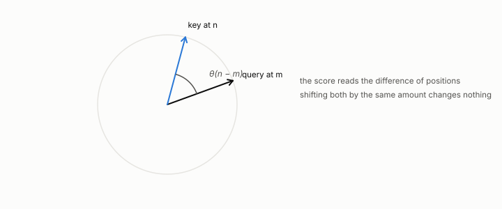

# rotary position embedding

**id.** rotary-position-embedding
**kind.** concept

## definition

A rotation applied to queries and keys that encodes where each token sits in the sequence. Chapter 0 section 0.11.

**Example.** A query at position 5 and a key at position 3 score exactly as they would at positions 105 and 103.

## equation

Book equation 0.23.

    \operatorname{softmax}(z)_i=\frac{e^{z_i}}{\sum_j e^{z_j}},\qquad \text{output}=\sum_i\operatorname{softmax}\!\Big(\frac{q\cdot k_i}{\sqrt{d}}\Big)_{\!i}\,v_i.

## conditions

- A rotation applied to queries and keys by an angle proportional to position. A rotation preserves length, and the score of a query at one position against a key at another depends only on the difference of positions, so a head reads relative position and shifting both positions by the same amount changes no score.
- A key quantizer that rounds the rotated key rounds its position as well as its content, which is part of why the direction-only quantizer moved the scores.

Conditions are curated in `entries.toml` rather than read from a record.

## ledger

none

## first stated

Su and others, RoFormer, 2021, as chapter 0 section 0.11 of *Data Mining as Observation* states it, with the program's key-side measurements in `turboquant-pro/docs/KV_KEYS_FINDING.md:1-49`.

## measurements

| Where the book states it | Numbers, as the book's sources table records them | Source |
|---|---|---|
| chapter 11 section 11.1 | condition (A2), cosine satisfies it, post-rotary keys do not, the cone below cell size | [`turboquant-pro/docs/KV_KEYS_FINDING.md:61-86`](https://github.com/ahb-sjsu/turboquant-pro/blob/856c4cb/docs/KV_KEYS_FINDING.md#L61-L86); `the-angular-observer/README.md:26-31` |
| chapter 11 section 11.2 | fp16 12.24, values-only 13.12, PolarQuant K4 10643 and 0.095, per-channel uniform K4 14.91 and 0.062, per-channel NUQ K3 15.77 and 0.148, 2.4x and 670x, pre-rotary near 22000, 2 key heads serve 12 query heads | [`turboquant-pro/docs/KV_KEYS_FINDING.md:1-49`](https://github.com/ahb-sjsu/turboquant-pro/blob/856c4cb/docs/KV_KEYS_FINDING.md#L1-L49) |

## failures and corrections

none

## invariance envelope

none declared

## machine checked

[`lean/DataMiningAsObservation/Rope.lean`](https://github.com/ahb-sjsu/observation-data-mining/blob/95af30c/lean/DataMiningAsObservation/Rope.lean), theorems `rot_length`, `rot_dot`, `relative_position`, `shift_invariant`, at observation-data-mining 95af30c; what the check covers is stated in the book's [appendix C](https://github.com/ahb-sjsu/observation-data-mining/blob/95af30c/chapters/machine_checked.md).

## used in

*Data Mining as Observation* chapters 0, 1, 2, 3, 4, 5, 6, 7, 8, 9, 10, 11, 12, 13, 14.

## related

attention, query-key-value, kv-cache, dot-product

## see also

Book equations stated beside the entry's terms, not defining it: 11.1.

Ledger rows that cite the entry's records without naming it: NEG-2.

Sources-table rows that share a record with the entry without naming it: chapter 1 section 1.4, chapter 2 section 2.5, chapter 3 section 3.2, chapter 8 section 8.2.

## status

Generated 2026-09-09 by `encyclopedia/generate.py`; book at observation-data-mining 95af30c; the commit of every record is listed in the encyclopedia's provenance.
