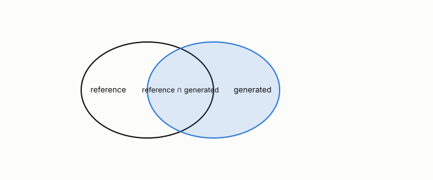

# ROUGE

**id.** rouge
**kind.** concept

## definition

A family of scores for generated text against a reference. Chapter 0 section 0.11.

**Example.** A generated text that reproduces 6 of a reference's 8 unigrams has ROUGE-1 recall 0.75.

## equation

none

## conditions

- A family of scores for generated text against a reference. ROUGE-1 recall counts the reference's words the candidate contains, with multiplicity, over the reference's length. It lies in the unit interval, is one for the reference itself, and is one for any rearrangement of the reference, since it reads bags and not order.
- A ROUGE score therefore certifies less than it seems to. The 13.7 ROUGE-L difference at 512 tokens re-validated at negative 0.31 on forty documents, and the claims ledger carries both numbers.

Conditions are curated in `entries.toml` rather than read from a record.

## ledger

none

## first stated

Lin, ROUGE, 2004, as chapter 0 section 0.11 states it, with the program's 13.7 ROUGE-L number and its re-validation in `turboquant-pro/CLAIMS.md:63-81`.

## measurements

| Where the book states it | Numbers, as the book's sources table records them | Source |
|---|---|---|
| chapter 8 section 8.9 | 13.7 ROUGE-L, 0.25/4.19/9.60/13.7 at 64/128/256/512, re-validation negative 0.31 n=40, 26.64 under symmetric nf4, `_quant_nf4a_group` unchanged since `289bdfc` before `4f7baab` | [`turboquant-pro/CLAIMS.md:63-81`](https://github.com/ahb-sjsu/turboquant-pro/blob/856c4cb/CLAIMS.md#L63-L81); [`turboquant-pro/benchmarks/kvquant_matrix/REVAL-2026-08-08.md`](https://github.com/ahb-sjsu/turboquant-pro/blob/856c4cb/benchmarks/kvquant_matrix/REVAL-2026-08-08.md) |

## failures and corrections

none

## invariance envelope

none declared

## machine checked

[`lean/DataMiningAsObservation/Rouge.lean`](https://github.com/ahb-sjsu/observation-data-mining/blob/f3914f0/lean/DataMiningAsObservation/Rouge.lean), theorems `overlap_le`, `rouge1_mem_unit`, `rouge1_self`, `rouge1_perm`, at observation-data-mining f3914f0; what the check covers is stated in the book's [appendix C](https://github.com/ahb-sjsu/observation-data-mining/blob/f3914f0/chapters/machine_checked.md).

## used in

*Data Mining as Observation* chapters 0, 8.

## related

bag-of-words, perplexity, harness, certificate

## see also

Book equations stated beside the entry's terms, not defining it: 0.22.

Ledger rows that cite the entry's records without naming it: NEG-4.

## status

Generated 2026-09-09 by `encyclopedia/generate.py`; book at observation-data-mining f3914f0; the commit of every record is listed in the encyclopedia's provenance.
