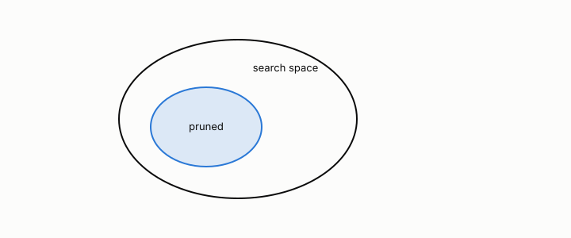

# safe pruning

**id.** safe-pruning
**kind.** concept

## definition

A rule for discarding candidates during a search that is guaranteed to discard no solution. The Apriori principle and the Monotone Invariance Theorem are the book's two instances. Chapter 5.

**Example.** A node whose Youden ceiling is 0.70 cannot beat the best F1 found so far, 0.80, so its subtree is skipped.

## equation

Book equation 5.4.

    \begin{gathered} F_1^{\max}\ \le\ \sup_{t\in[J,\,1]}\ \frac{2t\pi}{t\pi+\pi+(t-J)(1-\pi)},\qquad J=\max_{\tau}\big(\mathrm{TPR}-\mathrm{FPR}\big),\qquad \pi=\text{prevalence}, \\ J\le 2A-1\ \text{when the ROC curve is concave, and not in general.} \end{gathered}

## conditions

- A pruning rule is safe when the pruned search returns the same answer as the unpruned one on every input. The Apriori principle and the Monotone Invariance Theorem are safe by proof.
- A learned or heuristic rule cannot earn that word from a finite test. It can be empirically lossless on the held-out cases, and the record says which cases.
- The AUROC form of the F1 ceiling is a safe pruning bound only for concave ROC curves. The Youden form is sound for every score at the leaf, and pruning a subtree by its root's ceiling is a heuristic in both forms.

Conditions are curated in `entries.toml` rather than read from a record.

## ledger

none

## first stated

Chapter 5 section 5.4 of *Data Mining as Observation*, with the program's two owned instances in theory-radar and arc-equivariant-search.

## measurements

none

## failures and corrections

- [`theory-radar/ERRATA.md:3-75`](https://github.com/ahb-sjsu/theory-radar/blob/37c4e6c/ERRATA.md#L3-L75) at 37c4e6c. 2026-09-03. The AUROC to F1 bound holds only for concave ROC curves **What was claimed.** Theorem "AUROC-F1 Bound" in `paper/astar_paper.tex`, the derivation in `src/symbolic_search/_auroc_proof.py`, and the pruning bounds in `run_astar_v2.py` and `src/symbolic_search/_heuristic_dag.py` all rested on the statement that any ROC curve with area A has maximum Youden index J = max(TPR − FPR) at most 2A − 1. **Why it is wrong.** The statement holds for concave ROC curves (equivalently, scores whose likelihood ratio is monotone), because a concave curve lies above the two chords through its Youden point and so has area at least (1 + J)/2. It fails for non-concave curves. Counterexample, found by an external reviewer of the companion textbook: rank three quarters of the positives above every negative and the remaining quarter below every negative. AUROC is 0.75, the maximum Youden index is 0.75, and at prevalence one half the best thresholded F1 is 0.857, above the 0.80 the AUROC form of the ceiling allows. The sound ceiling for that score, from J = 0.75, is 0.889, and the score sits under it. The `auroc_f1_bound` formula in `run_astar_v2.py`, 2Aπ/(Aπ + (1 − A)(1 − π)), is not a valid upper bound either: at prevalence 0.1 the same score reaches F1 0.857 against a "bound" of 0.5. **Consequence for reported results.** The searches that used these bounds to prune could have discarded a candidate formula whose ROC curve was not concave and whose true best F1 exceeded the computed ceiling. The formulas and wins reported by those runs are therefore what a pruned search found, and are lower bounds on what an unpruned search would find. The Monotone Invariance Theorem and the results that do not depend on the AUROC bound are unaffected. **Correction.** The sound form of the ceiling substitutes the measured maximum Youden index of the candidate's own scores for 2A − 1. It holds for every score, costs the same sort as AUROC, and is what `max_f1_for_youden` and `youden_f1_bound` now compute. The AUROC form is retained under its original names with a docstring stating the concavity condition, and the pruning sites now use the measured index. A rerun of the published searches under the corrected bound was done on 2026-09-03 and 2026-09-04, `rerun_youden_2026_09_03.py`, results in `results/rerun_youden_2026_09_03.json`, run on the Atlas workstation, CPU only. **Rerun, part A, the pre-filter admissibility table (`tab:auroc`).** Depth-2 pairwise enumeration on the eight datasets, exhaustive against the AUROC pre-filter at the seven published thresholds, with the sound Youden ceiling beside it. The evaluation counts under the pre-filter reproduce the published table (Breast Cancer 8700 pairs, 2576 evaluated at 0.75; Wine 1560, 413; Circles 20, 4; Moons 20, 2). The pre-filter lost no optimum on any dataset at any threshold, which is what the paper reported. That was luck of the data, not the theorem: the retracted ceiling sat below the F1 a pair formula actually reach

## invariance envelope

none declared

## machine checked

[`lean/DataMiningAsObservation/SafePruning.lean`](https://github.com/ahb-sjsu/observation-data-mining/blob/f3914f0/lean/DataMiningAsObservation/SafePruning.lean), theorems `support_anti`, `apriori`, `subset_of_frequent`, at observation-data-mining f3914f0; what the check covers is stated in the book's [appendix C](https://github.com/ahb-sjsu/observation-data-mining/blob/f3914f0/chapters/machine_checked.md).

[`lean/DataMiningAsObservation/YoudenF1.lean`](https://github.com/ahb-sjsu/observation-data-mining/blob/f3914f0/lean/DataMiningAsObservation/YoudenF1.lean), theorems `f1_eq`, `f1_le_of_youden`, `auroc_eq`, `youden_eq`, `youden_exceeds_auroc_form`, at observation-data-mining f3914f0; what the check covers is stated in the book's [appendix C](https://github.com/ahb-sjsu/observation-data-mining/blob/f3914f0/chapters/machine_checked.md).

## used in

*Data Mining as Observation* chapters 5.

## related

apriori, monotone-invariance, youden-f1-bound, formula-search

## see also

Book equations stated beside the entry's terms, not defining it: 5.3.

Sources-table rows that share a record with the entry without naming it: chapter 5 section 5.4, chapter 6 section 6.3, chapter 6 section 6.4, chapter 6 section 6.5, chapter 7 section 7.3, chapter 8 section 8.5.

## status

Generated 2026-09-12 by `encyclopedia/generate.py`; book at observation-data-mining f3914f0; the commit of every record is listed in the encyclopedia's provenance.
