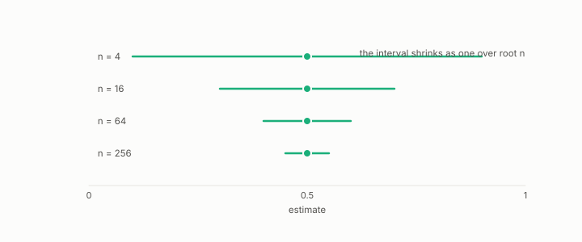

# sampling

**id.** sampling
**kind.** instrument

## definition

Choosing which rows to read. The standard error of a sample mean falls as one over the square root of the sample size. Chapter 2 section 2.7.

**Example.** Reading 350000 of 2391361 rows is a 15 percent sample, and its mean has standard error the spread over the square root of 350000.

## equation

none

## conditions

- Choosing which rows to read. A sample's mean lies between its smallest and largest row, the standard error of the mean falls as one over the square root of the sample size, and a sample too thin to score is abstained on rather than averaged in.
- Sampling and aggregation are design choices that decide what the reader can see, and the first strata run read 350000 of 2391361 rows and abstained on the strata with two rows and one.

Conditions are curated in `entries.toml` rather than read from a record.

## ledger

none

## first stated

Chapter 2 section 2.7 of *Data Mining as Observation*, with the first strata run's sample in `turboquant-pro/docs/STRATA_RFC.md:24-98`.

## measurements

none

## failures and corrections

none

## invariance envelope

none declared

## machine checked

[`lean/DataMiningAsObservation/StandardError.lean`](https://github.com/ahb-sjsu/observation-data-mining/blob/f3914f0/lean/DataMiningAsObservation/StandardError.lean), theorems `se_pos`, `se_quarter`, `se_antitone`, `se_tendsto_zero`, `thousand_folds`, at observation-data-mining f3914f0; what the check covers is stated in the book's [appendix C](https://github.com/ahb-sjsu/observation-data-mining/blob/f3914f0/chapters/machine_checked.md).

[`lean/DataMiningAsObservation/Ensemble.lean`](https://github.com/ahb-sjsu/observation-data-mining/blob/f3914f0/lean/DataMiningAsObservation/Ensemble.lean), theorems `average_between`, `sq_average_le`, `average_const`, at observation-data-mining f3914f0; what the check covers is stated in the book's [appendix C](https://github.com/ahb-sjsu/observation-data-mining/blob/f3914f0/chapters/machine_checked.md).

## used in

*Data Mining as Observation* primer S, chapters 0, 2, 3, 4, 5, 6, 8, 9, 10, 11, 12, 13, 14.

## related

standard-error, aggregation, bootstrap, seed, stratification

## see also

Book equations stated beside the entry's terms, not defining it: 0.18, 8.2, 2.1.

Ledger rows that cite the entry's records without naming it: NEG-14.

Sources-table rows that share a record with the entry without naming it: chapter 4 section 4.7, chapter 8 section 8.1, chapter 10 section 10.4.

## status

Generated 2026-09-10 by `encyclopedia/generate.py`; book at observation-data-mining f3914f0; the commit of every record is listed in the encyclopedia's provenance.
