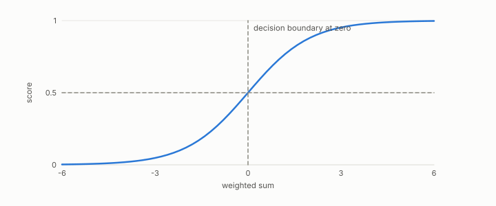

# score

**id.** score
**kind.** concept

## definition

The number a classifier produces per row before a threshold turns it into a decision. Chapter 6.

**Example.** A classifier outputs 0.73 for a row; the threshold, not the score, makes the decision.

## equation

Book equation 6.1.

    s(x)=w\cdot x+b,\qquad P_C=\mathbb E\big[\sigma'(s)^{2}\big]\,w\,w^{\top},\qquad \operatorname{rank}P_C=1.

Book equation 6.2.

    \begin{gathered} \max_{\tau,\ \mathrm{dir}}F_1\!\Big(\mathbf 1\big[\mathrm{dir}\big(g(f(X)),\tau\big)\big],\,y\Big)=\max_{\tau,\ \mathrm{dir}}F_1\!\Big(\mathbf 1\big[\mathrm{dir}\big(f(X),\tau\big)\big],\,y\Big) \\ \text{for every strictly monotone } g. \end{gathered}

## conditions

- The number a classifier produces per row before a threshold turns it into a decision. Every decision at every threshold is a function of the scores' ordering, so a strictly increasing recalibration of the scores with the matching recalibration of the threshold changes no decision.
- What a recalibration can change is calibration, which is why the reliability weight reads the ordering and the expected calibration error reads the values, and neither stands in for the other.

Conditions are curated in `entries.toml` rather than read from a record.

## ledger

none

## first stated

Chapter 6 section 6.1 of *Data Mining as Observation*, with the program's threshold sweeps in theory-radar.

## measurements

none

## failures and corrections

none

## invariance envelope

none declared

## machine checked

[`lean/DataMiningAsObservation/Threshold.lean`](https://github.com/ahb-sjsu/observation-data-mining/blob/f3914f0/lean/DataMiningAsObservation/Threshold.lean), theorems `predicted_anti`, `tp_anti`, `fp_anti`, `decision_comp`, `predicted_extremes`, at observation-data-mining f3914f0; what the check covers is stated in the book's [appendix C](https://github.com/ahb-sjsu/observation-data-mining/blob/f3914f0/chapters/machine_checked.md).

## used in

*Data Mining as Observation* primer S, chapters 0, 1, 2, 3, 4, 5, 6, 7, 8, 9, 10, 11, 12, 13, 14.

## related

classifier, threshold, monotone-invariance, calibration, reliability-weight

## see also

Sources-table rows that share a record with the entry without naming it: chapter 5 section 5.4, chapter 6 section 6.3.

## status

Generated 2026-09-12 by `encyclopedia/generate.py`; book at observation-data-mining f3914f0; the commit of every record is listed in the encyclopedia's provenance.
