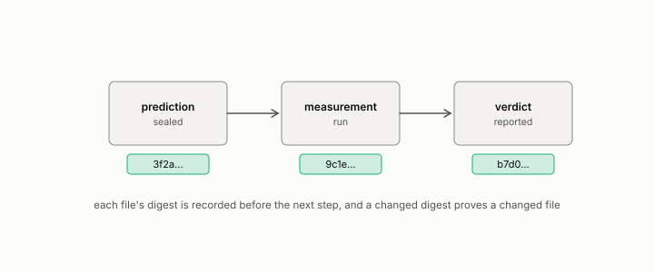

# sealed

**id.** sealed
**kind.** instrument

## definition

Of a prediction, committed with its hash recorded before the measurement was run, so that anyone with the repository can verify it has not changed, and with a public push, a signed tag, or an archival deposit to fix when. Chapter 0 section 0.12.

**Example.** The prediction file's SHA-256 was recorded in a commit pushed before the run, and the seal names the commit.

## equation

none

## conditions

- Of a prediction, committed with its hash recorded before the measurement, so that anyone with the repository can verify that the file has not changed. The hash proves the content. The time it existed is established by the public push, the signed tag, the transparency log, or the archival deposit that the seal names, since a commit's dates are supplied fields.
- A changed digest proves a changed file, an equal digest is evidence and not proof because a fixed-length digest of longer inputs cannot be injective, and every claim class in the ledger rests on a seal.

Conditions are curated in `entries.toml` rather than read from a record.

## ledger

none

## first stated

The program's seal ledger, `observation-theory-campaigns/experiments/SEALS.md:1-10`, a seal being the registration id, the sealing commit, and the SHA-256 of the sealed file at that commit, and chapter 0 section 0.12 of *Data Mining as Observation*.

## measurements

| Where the book states it | Numbers, as the book's sources table records them | Source |
|---|---|---|
| chapter 8 section 8.8 | seal = commit plus SHA-256 | [`observation-theory-campaigns/experiments/SEALS.md:1-10`](https://github.com/ahb-sjsu/observation-theory-campaigns/blob/ddc3aad/experiments/SEALS.md#L1-L10) |
| chapter 8 section 8.8 | declaration drafted 2026-08-17, sealed 2026-08-18, one count corrected, G2 | [`geometric-observation/crucible/DECLARATION-V1.md:1-20`](https://github.com/ahb-sjsu/geometric-observation/blob/fc6b378/crucible/DECLARATION-V1.md#L1-L20); [`geometric-observation/crucible/OT-CRUCIBLE-4.md:31-35`](https://github.com/ahb-sjsu/geometric-observation/blob/fc6b378/crucible/OT-CRUCIBLE-4.md#L31-L35) |
| chapter 12 section 12.6 | XPROTO-LLM, benchmark 0.909, 0.920, 0.909, thirty slices, target 0.8, naive 0.333, aware 0.033, spread 0.380, deployment mean 0.736, six bars on three seeds, sealed 2026-08-25 at b61f7f1 | [`observation-theory-campaigns/experiments/LLM-EVAL-TRACK.md:1-50`](https://github.com/ahb-sjsu/observation-theory-campaigns/blob/ddc3aad/experiments/LLM-EVAL-TRACK.md#L1-L50); [`observation-theory-campaigns/analysis/llm/XPROTO-LLM-graded.json`](https://github.com/ahb-sjsu/observation-theory-campaigns/blob/ddc3aad/analysis/llm/XPROTO-LLM-graded.json); [`observation-theory-campaigns/experiments/SEALS.md:85`](https://github.com/ahb-sjsu/observation-theory-campaigns/blob/ddc3aad/experiments/SEALS.md#L85) |
| chapter 13 section 13.4 | sealed correction, 0.5 dB calibration, floors 4/6/4, 2/2/3, 1, slopes 0.1008, 0.1398, 0.1086, R² 0.7376, 0.9218, 0.6174, bars B1 to B4 and MC1 to MC4 all true, seeds 20260827 to 20260829, sealed 1d3de4a | [`observation-theory-campaigns/analysis/csi/PREREG-XPROTO-CSI-SWEEP2.md:1-60`](https://github.com/ahb-sjsu/observation-theory-campaigns/blob/ddc3aad/analysis/csi/PREREG-XPROTO-CSI-SWEEP2.md#L1-L60); [`observation-theory-campaigns/analysis/csi/XPROTO-CSI-SWEEP2-graded.json`](https://github.com/ahb-sjsu/observation-theory-campaigns/blob/ddc3aad/analysis/csi/XPROTO-CSI-SWEEP2-graded.json); [`observation-theory-campaigns/experiments/SEALS.md:90`](https://github.com/ahb-sjsu/observation-theory-campaigns/blob/ddc3aad/experiments/SEALS.md#L90) |

## failures and corrections

- [`observation-theory-campaigns/ERRATA.md:111-120`](https://github.com/ahb-sjsu/observation-theory-campaigns/blob/ddc3aad/ERRATA.md#L111-L120) at ddc3aad. Standing note on records and runners Two failures this session shared one shape. A record was committed from a runner later found defective, and the correction was left uncommitted where nothing reading the repository could see it. The rule adopted in response is that a rerun writes to a new path and never over a committed record, and that the superseded record stays in the repository naming what replaced it. See the PF4-007 subsection of `experiments/CAMPAIGN.md`.

## invariance envelope

none declared

## machine checked

[`lean/DataMiningAsObservation/Seal.lean`](https://github.com/ahb-sjsu/observation-data-mining/blob/6aebdf3/lean/DataMiningAsObservation/Seal.lean), theorems `changed_of_hash_ne`, `hash_eq_of_eq`, `exists_collision`, at observation-data-mining 6aebdf3; what the check covers is stated in the book's [appendix C](https://github.com/ahb-sjsu/observation-data-mining/blob/6aebdf3/chapters/machine_checked.md).

## used in

*Data Mining as Observation* chapters 0, 1, 3, 4, 5, 6, 7, 8, 9, 10, 11, 12, 13, 14.

## related

preregistration, ledger-class, certificate, refresh-floor

## see also

Book equations stated beside the entry's terms, not defining it: 8.1.

Ledger rows that cite the entry's records without naming it: OT-7, OT-11.

Sources-table rows that share a record with the entry without naming it: chapter 8 section 8.8.

## status

Generated 2026-09-09 by `encyclopedia/generate.py`; book at observation-data-mining 6aebdf3; the commit of every record is listed in the encyclopedia's provenance.
