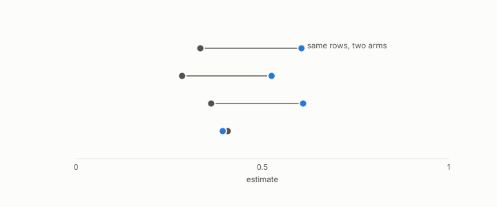

# seed

**id.** seed
**kind.** concept

## definition

The number that fixes a run's pseudo-randomness. Two runs with the same seed agree only when code, data, environment, and execution are also fixed, and different seeds are necessary but not sufficient for an independent replication. Chapter 8.

**Example.** Seed 20260827 fixed the run, and seeds 20260828 and 20260829 were the two replications.

## equation

Book equation 8.1.

    O_{\mathrm{harness}}=\big(C_{\mathrm{score}},\ G_{\mathrm{metric}},\ B=\text{folds}\times\text{samples}\times\text{seeds}\big).

## conditions

- The number that fixes a run's pseudo-randomness. Two runs with the same seed reproduce each other only when the code, data, environment, and execution are also fixed, since nondeterministic execution can differ at the same seed, and runs with different seeds are necessary but not sufficient for an independent replication.
- The standard error over n seeds falls as one over the square root of n, a paired comparison across seeds has smaller variance than an unpaired one exactly when the two arms covary, and a preregistration names its seeds before the run.

Conditions are curated in `entries.toml` rather than read from a record.

## ledger

none

## first stated

Chapter 8 section 8.1 of *Data Mining as Observation*, with the disjoint-seed rule of the database freshness track in `observation-theory-campaigns/experiments/DATABASE-FRESHNESS-TRACK.md`.

## measurements

| Where the book states it | Numbers, as the book's sources table records them | Source |
|---|---|---|
| chapter 4 section 4.4 | GO-4 budget inversion, fixed m 10 rises, matched m 121, 126, 159 collapses, 3 seeds | [`geometric-observation/claims/LEDGER.md`](https://github.com/ahb-sjsu/geometric-observation/blob/0792c84/claims/LEDGER.md) row GO-4 |
| chapter 13 section 13.3 | ZooKeeper hot 0.99 cold 0.01 witnessed 0.0, Postgres 0.50 to 0.06, MongoDB 0.47 to 0.03, production Postgres 0.47 to 0.02, real substrates, disjoint seeds | [`observation-theory-campaigns/experiments/DATABASE-FRESHNESS-TRACK.md:1-45`](https://github.com/ahb-sjsu/observation-theory-campaigns/blob/a0c4321/experiments/DATABASE-FRESHNESS-TRACK.md#L1-L45) |

## failures and corrections

none

## machine checked

[`lean/DataMiningAsObservation/StandardError.lean`](https://github.com/ahb-sjsu/observation-data-mining/blob/95af30c/lean/DataMiningAsObservation/StandardError.lean), theorems `se_pos`, `se_quarter`, `se_antitone`, `se_tendsto_zero`, `thousand_folds`, at observation-data-mining 95af30c; what the check covers is stated in the book's [appendix C](https://github.com/ahb-sjsu/observation-data-mining/blob/95af30c/chapters/machine_checked.md).

[`lean/DataMiningAsObservation/Bootstrap.lean`](https://github.com/ahb-sjsu/observation-data-mining/blob/95af30c/lean/DataMiningAsObservation/Bootstrap.lean), theorems `mean_sub`, `var_sub`, `paired_lt_iff`, `cov_comm`, at observation-data-mining 95af30c; what the check covers is stated in the book's [appendix C](https://github.com/ahb-sjsu/observation-data-mining/blob/95af30c/chapters/machine_checked.md).

## used in

*Data Mining as Observation* chapters 4, 6, 7, 8, 9, 11, 12, 13.

## related

harness, standard-error, bootstrap, preregistration, sealed

## see also

Book equations stated beside the entry's terms, not defining it: 0.18, 8.2.

Ledger rows that cite the entry's records without naming it: NEG-14.

## status

Generated 2026-09-07 by `encyclopedia/generate.py`; book at observation-data-mining 95af30c; the commit of every record is listed in the encyclopedia's provenance.
