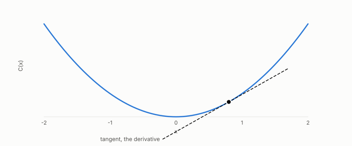

# sensitivity

**id.** sensitivity
**kind.** concept

## definition

The vector of partial derivatives of a consumer with respect to each coordinate of its input, at one point. Equation 0.8.

**Example.** For C(x1, x2) equal to 3x1 + 4x2 the sensitivity is (3, 4) at every row.

**Known as, or related to prior art.** The gradient of the consumer at a row, the quantity active-subspace methods average.

## equation

Book equation 0.8.

    g_j\;\approx\;\frac{C(x+h\,e_j)-C(x-h\,e_j)}{2h},\qquad j=1,\dots,d.

Book equation 0.11.

    P_C(x)=J(x)^{\top}G\big(C(x)\big)\,J(x),\qquad J(x)=\frac{\partial C}{\partial x}(x),\qquad \bar P_{C,\mu}=\mathbb E_{\mu}\!\left[P_C(x)\right].

Book equation 14.4.

    \text{attribution}_j(x)\approx g_j(x)\,\delta_j,\qquad \overline{\text{importance}}_j\approx\big(P_C\big)_{jj}=\mathbb E\big[g_j^{2}\big].

## conditions

- The sensitivity of a consumer at a row is the vector of partial derivatives of its output with respect to each coordinate, measurable without the formula by a central finite difference at two calls per coordinate.
- The read operator is the workload average of the sensitivity's outer product, so its diagonal is the expected squared sensitivity to each feature and its off-diagonal entries are co-sensitivities, not interactions.
- A gradient-based attribution estimates the sensitivity. Permutation importance, partial dependence, and Shapley values measure other things.

Conditions are curated in `entries.toml` rather than read from a record.

## ledger

none

## first stated

Volume 14, chapter 5, `geometric-observation/chapters/ch05_the_read_metric_and_the_quotient.md:7-48`, DOI 10.5281/zenodo.21776291, as the gradient of the consumer at a row.

## measurements

| Where the book states it | Numbers, as the book's sources table records them | Source |
|---|---|---|
| chapter 6 section 6.1 | selection consumers have zero sensitivity almost everywhere | [`readscope/readscope/regimes.py:1-60`](https://github.com/ahb-sjsu/readscope/blob/c8d0289/readscope/regimes.py#L1-L60) |

## failures and corrections

none

## machine checked

[`lean/DataMiningAsObservation/ReadOperator.lean`](https://github.com/ahb-sjsu/observation-data-mining/blob/95af30c/lean/DataMiningAsObservation/ReadOperator.lean), theorems `rank_one_reads_one_direction`, `readOp_mulVec`, `quad_readOp`, `quad_readOp_nonneg`, `readOp_mulVec_eq_zero_iff`, `readOp_diag`, `readOp_offdiag`, `readOp_symm`, `readOp_neg`, `affine_const_along_nuisance`, `readOp_affine`, `readOp_sqLength_basis`, at observation-data-mining 95af30c; what the check covers is stated in the book's [appendix C](https://github.com/ahb-sjsu/observation-data-mining/blob/95af30c/chapters/machine_checked.md).

## used in

*Data Mining as Observation* chapters 0, 1, 2, 4, 6, 7, 8, 11, 14.

## related

read-operator, consumer, blind-probe, read-subspace

## see also

Ledger rows that cite the entry's records without naming it: NEG-14, GO-EC-3.

Sources-table rows that share a record with the entry without naming it: chapter 2 section 2.2, chapter 2 section 2.3.

## status

Generated 2026-09-07 by `encyclopedia/generate.py`; book at observation-data-mining 95af30c; the commit of every record is listed in the encyclopedia's provenance.
