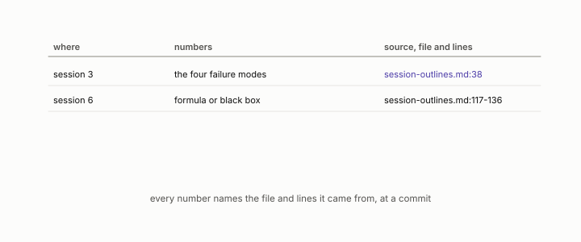

# session deck

**id.** session-deck
**kind.** reference

## definition

The lecture deck of ECE 514, cited by line range from the instructor's session outlines, which are not public. Chapter 1 section 1.6.

**Example.** Session outline lines 117 to 136 state the transferable idea of chapter 5 as a learning outcome.

## equation

none

## conditions

- The lecture deck of the course the book accompanies, ECE 514, cited by line range from the instructor's session outlines. A row that names it names a file and lines like every other source, and a changed digest would prove a changed deck.
- The deck is not public. The book quotes what it says and marks each such row as instructor working documents, and the reader who wants the deck asks the instructor.

Conditions are curated in `entries.toml` rather than read from a record.

## ledger

none

## first stated

Chapter 1 section 1.6 of *Data Mining as Observation*, citing the instructor's working documents, `ECE_514-01_FA26_session-outlines.md`, which are not public.

## measurements

none

## failures and corrections

none

## invariance envelope

none declared

## machine checked

[`lean/DataMiningAsObservation/Seal.lean`](https://github.com/ahb-sjsu/observation-data-mining/blob/95af30c/lean/DataMiningAsObservation/Seal.lean), theorems `changed_of_hash_ne`, `hash_eq_of_eq`, `exists_collision`, at observation-data-mining 95af30c; what the check covers is stated in the book's [appendix C](https://github.com/ahb-sjsu/observation-data-mining/blob/95af30c/chapters/machine_checked.md).

## used in

*Data Mining as Observation* chapters 1, 2, 3, 4, 5, 6, 8, 10, 11, 12, 14.

## related

sources-table, commit-hash, harness, preregistration

## see also

Book equations stated beside the entry's terms, not defining it: 1.1.

Sources-table rows that share a record with the entry without naming it: chapter 1 section 1.1, chapter 1 section 1.3, chapter 1 section 1.6, chapter 1 section 1.7, chapter 2 section 2.3, chapter 5 section 5.3, chapter 7 section 7.6.

## status

Generated 2026-09-08 by `encyclopedia/generate.py`; book at observation-data-mining 95af30c; the commit of every record is listed in the encyclopedia's provenance.
