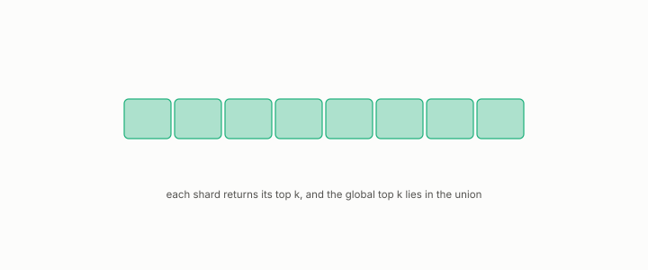

# shard

**id.** shard
**kind.** instrument

## definition

One partition of an index that is searched separately, with the results merged. The global top k lies inside the union of the shards' top k. Chapter 13.

**Example.** Eight shards each returning their top 10 hand the merger 80 candidates, among which the global top 10 lies.

## equation

none

## conditions

- One partition of an index that is searched separately, with the results merged. If each shard returns its own top k and the global top k is strict, the global top k lies inside the union of the shards' answers, so the merge loses nothing and reads at most the number of shards times k candidates.
- A placement study over 64 shards reported search times taken with the file cache already holding the shards, and a speedup of 63.7 times was fragmentation, so a sharded number names whether it is warm and what the shards were.

Conditions are curated in `entries.toml` rather than read from a record.

## ledger

none

## first stated

Chapter 13 section 13.1 of *Data Mining as Observation*, with the placement study in `turboquant-pro/docs/RESEARCH_ROADMAP.md:133-160` and the fleet run in `openvector-bench/README.md:250-263`.

## measurements

| Where the book states it | Numbers, as the book's sources table records them | Source |
|---|---|---|
| chapter 13 section 13.1 | 22.30 s cold vs 0.835 s warm at eight probes, every prior number warm, fragmentation 63.7 bracketing 42 to 47, 64 shards, routing sparsity computed and discarded | [`turboquant-pro/docs/RESEARCH_ROADMAP.md:133-160`](https://github.com/ahb-sjsu/turboquant-pro/blob/856c4cb/docs/RESEARCH_ROADMAP.md#L133-L160) |

## failures and corrections

none

## invariance envelope

none declared

## machine checked

[`lean/DataMiningAsObservation/Shard.lean`](https://github.com/ahb-sjsu/observation-data-mining/blob/95af30c/lean/DataMiningAsObservation/Shard.lean), theorems `global_in_local`, `global_in_union`, `merge_cost`, at observation-data-mining 95af30c; what the check covers is stated in the book's [appendix C](https://github.com/ahb-sjsu/observation-data-mining/blob/95af30c/chapters/machine_checked.md).

## used in

*Data Mining as Observation* chapters 11, 13.

## related

inverted-file, recall-at-k, cold-warm, cache, budget

## see also

Book equations stated beside the entry's terms, not defining it: 11.3, 11.4, 13.2.

Ledger rows that cite the entry's records without naming it: GO-12.

Sources-table rows that share a record with the entry without naming it: chapter 8 section 8.4, chapter 11 section 11.4, chapter 13 section 13.1.

## status

Generated 2026-09-08 by `encyclopedia/generate.py`; book at observation-data-mining 95af30c; the commit of every record is listed in the encyclopedia's provenance.
