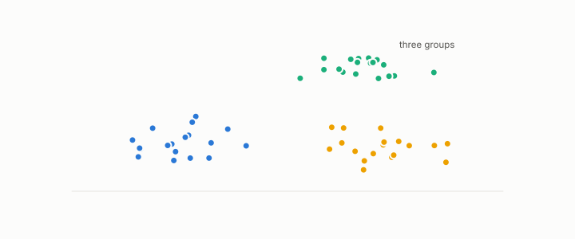

# silhouette

**id.** silhouette
**kind.** concept

## definition

For a row, the difference between its mean distance to the nearest other cluster and its mean distance to its own cluster, divided by the larger of the two. Equation 0.30.

**Example.** A point with mean distance 1 to its own cluster and 4.5 to the nearest other has silhouette 3.5 over 4.5, or 0.778.

## equation

Book equation 0.30.

    \mathrm{SSE}=\sum_{k}\sum_{i\in\mathcal C_k}\|x_i-c_k\|^{2},\qquad s_i=\frac{b_i-a_i}{\max(a_i,b_i)}.

## conditions

- For a row, the difference between its mean distance to the nearest other cluster and its mean distance to its own cluster, over the larger of the two. It lies between minus one and one, is positive exactly when the row is closer to its own cluster, and is unchanged when every distance is scaled by the same factor.
- It is computed under the identity reader on the distances it is given, so it validates a clustering for that reader and not for a consumer that reads other directions, which is why chapter 9 asks the recognizer to name the manifold instead.

Conditions are curated in `entries.toml` rather than read from a record.

## ledger

none

## first stated

Rousseeuw, silhouettes, 1987, as TSK chapter 7 presents it and chapter 0 section 0.15 states it, and chapter 9 of *Data Mining as Observation*, where it is one validity index among those the recognizer replaces.

## measurements

none

## failures and corrections

none

## invariance envelope

none declared

## machine checked

[`lean/DataMiningAsObservation/Silhouette.lean`](https://github.com/ahb-sjsu/observation-data-mining/blob/a0db6a8/lean/DataMiningAsObservation/Silhouette.lean), theorems `silhouette_mem`, `silhouette_pos_iff`, `silhouette_scale`, `silhouette_self`, at observation-data-mining a0db6a8; what the check covers is stated in the book's [appendix C](https://github.com/ahb-sjsu/observation-data-mining/blob/a0db6a8/chapters/machine_checked.md).

## used in

*Data Mining as Observation* chapters 0, 9, 10.

## related

recognizer, vacuity-threshold, identity-reader, quotient

## see also

Book equations stated beside the entry's terms, not defining it: 9.1.

## status

Generated 2026-09-09 by `encyclopedia/generate.py`; book at observation-data-mining a0db6a8; the commit of every record is listed in the encyclopedia's provenance.
