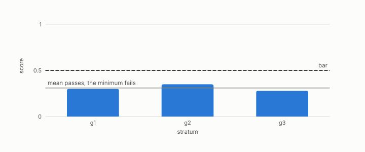

# Simpson's paradox

**id.** simpsons-paradox
**kind.** concept

## definition

A reversal of a comparison when groups are combined, which the book reads as an aggregation quotient. Chapter 5.

**Example.** A treatment better in both the young and the old can be worse overall when the two groups are mixed unequally.

## equation

none

## conditions

- A pooled rate is the size-weighted mean of the group rates, so pooling is a quotient that declares the group labels irrelevant, and it can reverse a comparison that holds in every group when the groups have different sizes under the two arms.
- With equal group sizes under both arms the pooled comparison agrees with a comparison that holds in every group. The book's answer is the min-over-strata verdict, which never pools.

Conditions are curated in `entries.toml` rather than read from a record.

## ledger

none

## first stated

TSK chapter 5 on objective measures, as chapter 5 section 5.5 of *Data Mining as Observation* reads it, an aggregation quotient.

## measurements

| Where the book states it | Numbers, as the book's sources table records them | Source |
|---|---|---|
| chapter 5 section 5.1 to 5.3, 5.5 | support, confidence, lift, the Apriori principle, FP-growth, closed and maximal itemsets, objective measures, Simpson's paradox, cross-support | TSK 2e chapter 5 |

## failures and corrections

none

## invariance envelope

none declared

## machine checked

[`lean/DataMiningAsObservation/Simpson.lean`](https://github.com/ahb-sjsu/observation-data-mining/blob/95af30c/lean/DataMiningAsObservation/Simpson.lean), theorems `pooled_eq_weighted`, `reversal`, `no_reversal_of_equal_sizes`, at observation-data-mining 95af30c; what the check covers is stated in the book's [appendix C](https://github.com/ahb-sjsu/observation-data-mining/blob/95af30c/chapters/machine_checked.md).

## used in

*Data Mining as Observation* chapters 5.

## related

quotient, min-over-strata, abstention, deployment-mismatch

## see also

Book equations stated beside the entry's terms, not defining it: 10.7.

## status

Generated 2026-09-09 by `encyclopedia/generate.py`; book at observation-data-mining 95af30c; the commit of every record is listed in the encyclopedia's provenance.
