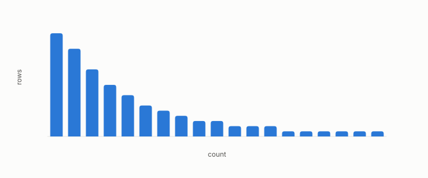

# skewness

**id.** skewness
**kind.** concept

## definition

The mean cubed deviation of a column from its mean over the cube of its spread, zero for a symmetric column. The hubness gate reads it. Chapter 3 section 3.5.

**Example.** Counts of 1, 1, 1, 1, and 10 have a long right tail and positive skewness, and a symmetric column has zero.

## equation

none

## conditions

- The weighted mean cubed deviation of a column from its mean over the cube of its spread. It is unchanged by a shift and by a positive rescaling, changes sign when the column is negated, and is zero for a column symmetric about its mean.
- The hubness gate reads the skew of the neighbour-count distribution, and the remedy that was to fix it moved the skew from 3.970 to 3.177 while the compressed path still failed every stratum.

Conditions are curated in `entries.toml` rather than read from a record.

## ledger

none

## first stated

Chapter 3 section 3.5 and chapter 10 section 10.2 of *Data Mining as Observation*, with the hubness gate's skew in `openvector-bench/results/R13_STAGE1_RESULT.md:75-110`.

## measurements

| Where the book states it | Numbers, as the book's sources table records them | Source |
|---|---|---|
| chapter 10 section 10.5 | Gate A design error, A prime skew 3.970 to 3.177, max 287 to 213, Robin Hood 0.372 to 0.261, fraction 0.117 to 0.079, compressed path 0.663 vs 0.90, seven strata, 0.62 to 0.69 vs 0.76 to 0.84 | [`turboquant-pro/docs/RESULTS_strata_phase23_gates.md:1-45`](https://github.com/ahb-sjsu/turboquant-pro/blob/856c4cb/docs/RESULTS_strata_phase23_gates.md#L1-L45) |

## failures and corrections

none

## invariance envelope

none declared

## machine checked

[`lean/DataMiningAsObservation/Skewness.lean`](https://github.com/ahb-sjsu/observation-data-mining/blob/f3914f0/lean/DataMiningAsObservation/Skewness.lean), theorems `skew_shift`, `skew_scale`, `skew_neg`, `skew_symmetric`, at observation-data-mining f3914f0; what the check covers is stated in the book's [appendix C](https://github.com/ahb-sjsu/observation-data-mining/blob/f3914f0/chapters/machine_checked.md).

## used in

*Data Mining as Observation* primer S, chapters 3, 5, 10, 11.

## related

hubness, robin-hood-index, variance, gate, percentile

## see also

Book equations stated beside the entry's terms, not defining it: 0.35, 10.3, 0.17.

Ledger rows that cite the entry's records without naming it: NEG-14.

Sources-table rows that share a record with the entry without naming it: chapter 10 section 10.2, chapter 10 section 10.4, chapter 10 section 10.5.

## status

Generated 2026-09-12 by `encyclopedia/generate.py`; book at observation-data-mining f3914f0; the commit of every record is listed in the encyclopedia's provenance.
